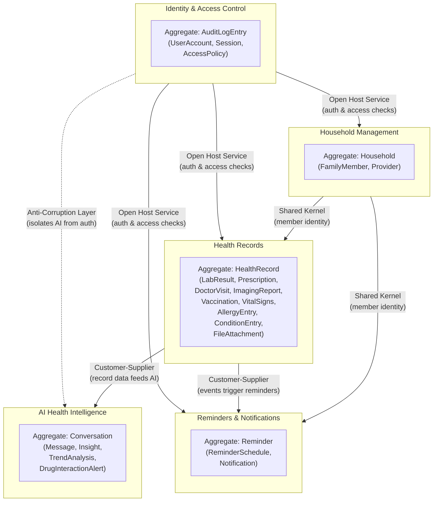

# Context Map — Family Health Tracker

> Phase p0 — Bounded-context integration patterns and dependency flow.

---

## Mermaid Diagram



---

## Integration Patterns

| Upstream → Downstream | Pattern | Justification |
|------------------------|---------|---------------|
| **Household Management → Health Records** | **Shared Kernel** | Both contexts must agree on FamilyMember identity. The kernel is small — member ID, name, and household ID — avoiding a heavier integration mechanism. |
| **Household Management → Reminders** | **Shared Kernel** | Reminders reference the same member identity; the shared kernel ensures a single source of truth for who a reminder belongs to. |
| **Health Records → AI Health Intelligence** | **Customer-Supplier** | Health Records is the upstream data producer. AI Intelligence consumes structured record data to generate insights. The supplier (Health Records) defines the data contract; the consumer (AI) adapts to it. |
| **Health Records → Reminders & Notifications** | **Customer-Supplier** | Health Records emits domain events (e.g., `PrescriptionCreated`, `DoctorVisitCompleted`) that the Reminders context subscribes to for creating follow-up reminders. Health Records owns the event schema. |
| **Identity & Access → Household Management** | **Open Host Service** | Identity exposes a standardised auth/authz interface (verify token, check permissions) consumed as a shared service. Household Management conforms to this contract without coupling to its internals. |
| **Identity & Access → Health Records** | **Open Host Service** | Same rationale — Health Records calls the Identity service to enforce per-member access control before returning query results. |
| **Identity & Access → AI Health Intelligence** | **Anti-Corruption Layer** | The AI context must stay focused on health analysis logic. An ACL translates access-control queries at the boundary, preventing auth concerns from leaking into AI domain models. |
| **Identity & Access → Reminders** | **Open Host Service** | Reminders calls Identity to verify the requesting user may create/view reminders for a given family member. |

---

## Dependency Flow Summary

```
Identity & Access Control  (supporting — consumed by all)
         │
         ▼
Household Management  (core — owns member identity)
         │
         ▼
Health Records  (core — owns all clinical data)
         │
         ├──▶ AI Health Intelligence  (analysis consumer)
         │
         └──▶ Reminders & Notifications  (event consumer)
```

- **Identity & Access** and **Household Management** are the foundation layers; every other context depends on them.
- **Health Records** is the central core domain — it produces the data that AI and Reminders consume.
- **AI Health Intelligence** and **Reminders** are downstream consumers with no direct dependency between each other.
