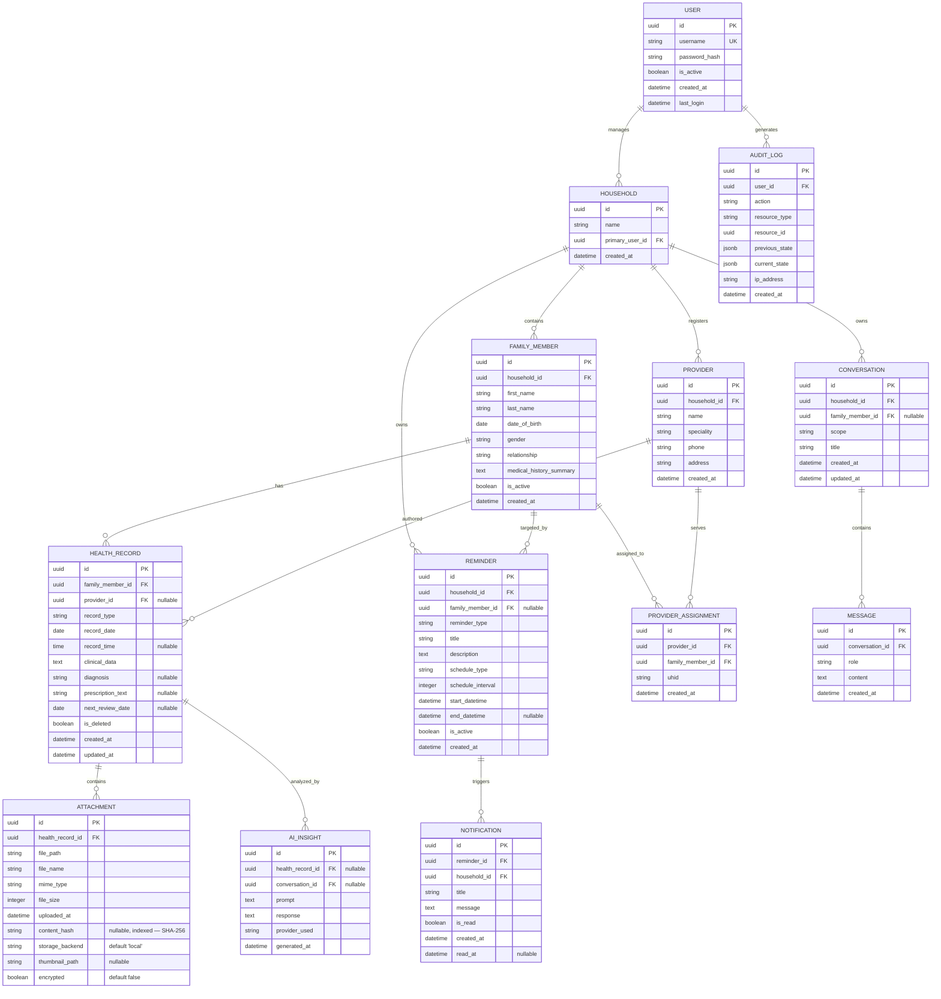

# Specification — Family Health Tracker

> Phase p2 — Technical specification derived from `docs/01-requirements/REQUIREMENTS.md`.

---

## 1. System Overview

**Architecture Style:** Layered REST API with service-oriented business logic.

**Technology Stack:**
- **Runtime:** Python 3.12+
- **Web Framework:** FastAPI 0.115+
- **ORM:** SQLAlchemy 2.x with mapped dataclasses
- **Database:** SQLite with SQLCipher (encrypted at rest)
- **Validation:** Pydantic v2
- **Authentication:** Session-based with secure cookies
- **Password Hashing:** Argon2
- **AI Provider:** Multi-provider failover (Gemini → Groq → OpenRouter → Ollama Cloud → Ollama Local)

**Deployment:** Docker Compose (single host, TLS via reverse proxy)

---

## 2. Data Model

### 2.1 Mermaid ER Diagram



### 2.2 SQLAlchemy Mapped Dataclasses

```python
# backend/app/models/base.py
from dataclasses import dataclass, field
from datetime import datetime
from uuid import UUID, uuid4
from sqlalchemy import ForeignKey, event
from sqlalchemy.orm import Mapped, mapped_column, relationship, DeclarativeBase
from sqlalchemy.types import String, Text, DateTime, Boolean, Date, Time, Integer, Float, Enum, LargeBinary
from sqlalchemy.dialects.sqlite import JSON as SQLiteJSON
import enum

class Base(DeclarativeBase):
    pass

class Gender(str, enum.Enum):
    MALE = "male"
    FEMALE = "female"
    OTHER = "other"
    PREFER_NOT_TO_SAY = "prefer_not_to_say"

class Relationship(str, enum.Enum):
    SELF = "self"
    SPOUSE = "spouse"
    CHILD = "child"
    PARENT = "parent"
    SIBLING = "sibling"
    OTHER = "other"

class RecordType(str, enum.Enum):
    DOCTOR_VISIT = "doctor_visit"
    LAB_TEST = "lab_test"
    PRESCRIPTION = "prescription"
    IMAGING_REPORT = "imaging_report"
    VACCINATION = "vaccination"
    VITAL_SIGNS = "vital_signs"
    ALLERGY_ENTRY = "allergy_entry"
    CONDITION_ENTRY = "condition_entry"
    BLOOD_GLUCOSE = "blood_glucose"
    HBA1C = "hba1c"
    EYEGLASS_PRESCRIPTION = "eyeglass_prescription"
    PARKINSONS_SYMPTOM = "parkinsons_symptom"

class ReminderType(str, enum.Enum):
    APPOINTMENT = "appointment"
    MEDICATION = "medication"
    FOLLOW_UP = "follow_up"
    CHECK_UP = "check_up"
    PRESCRIPTION_REFILL = "prescription_refill"

class ScheduleType(str, enum.Enum):
    ONCE = "once"
    DAILY = "daily"
    WEEKLY = "weekly"
    CUSTOM = "custom"

class MessageRole(str, enum.Enum):
    USER = "user"
    ASSISTANT = "assistant"
    SYSTEM = "system"

class ConversationScope(str, enum.Enum):
    MEMBER = "member"
    GENERAL = "general"

@dataclass
class User(Base):
    __tablename__ = "users"
    
    id: Mapped[UUID] = mapped_column(primary_key=True, default=uuid4)
    username: Mapped[str] = mapped_column(String(50), unique=True, nullable=False, index=True)
    password_hash: Mapped[str] = mapped_column(String(255), nullable=False)
    is_active: Mapped[bool] = mapped_column(Boolean, default=True, nullable=False)
    created_at: Mapped[datetime] = mapped_column(DateTime, default=datetime.utcnow, nullable=False)
    last_login: Mapped[datetime | None] = mapped_column(DateTime, nullable=True)
    
    households: Mapped[list["Household"]] = relationship("Household", back_populates="primary_user")
    audit_logs: Mapped[list["AuditLog"]] = relationship("AuditLog", back_populates="user")

@dataclass
class Household(Base):
    __tablename__ = "households"
    
    id: Mapped[UUID] = mapped_column(primary_key=True, default=uuid4)
    name: Mapped[str] = mapped_column(String(100), nullable=False)
    primary_user_id: Mapped[UUID] = mapped_column(ForeignKey("users.id"), nullable=False)
    created_at: Mapped[datetime] = mapped_column(DateTime, default=datetime.utcnow, nullable=False)
    
    primary_user: Mapped[User] = relationship("User", back_populates="households")
    members: Mapped[list["FamilyMember"]] = relationship("FamilyMember", back_populates="household", cascade="all, delete-orphan")
    providers: Mapped[list["Provider"]] = relationship("Provider", back_populates="household", cascade="all, delete-orphan")
    conversations: Mapped[list["Conversation"]] = relationship("Conversation", back_populates="household", cascade="all, delete-orphan")
    reminders: Mapped[list["Reminder"]] = relationship("Reminder", back_populates="household", cascade="all, delete-orphan")
    notifications: Mapped[list["Notification"]] = relationship("Notification", back_populates="household", cascade="all, delete-orphan")

@dataclass
class FamilyMember(Base):
    __tablename__ = "family_members"
    
    id: Mapped[UUID] = mapped_column(primary_key=True, default=uuid4)
    household_id: Mapped[UUID] = mapped_column(ForeignKey("households.id"), nullable=False)
    first_name: Mapped[str] = mapped_column(String(50), nullable=False)
    last_name: Mapped[str] = mapped_column(String(50), nullable=False)
    date_of_birth: Mapped[date] = mapped_column(Date, nullable=False)
    gender: Mapped[Gender] = mapped_column(Enum(Gender), nullable=False)
    relationship: Mapped[Relationship] = mapped_column(Enum(Relationship), nullable=False)
    medical_history_summary: Mapped[str | None] = mapped_column(Text, nullable=True)
    is_active: Mapped[bool] = mapped_column(Boolean, default=True, nullable=False)
    created_at: Mapped[datetime] = mapped_column(DateTime, default=datetime.utcnow, nullable=False)
    
    household: Mapped[Household] = relationship("Household", back_populates="members")
    health_records: Mapped[list["HealthRecord"]] = relationship("HealthRecord", back_populates="family_member", cascade="all, delete-orphan")
    provider_assignments: Mapped[list["ProviderAssignment"]] = relationship("ProviderAssignment", back_populates="family_member", cascade="all, delete-orphan")
    conversations: Mapped[list["Conversation"]] = relationship("Conversation", back_populates="family_member")
    reminders: Mapped[list["Reminder"]] = relationship("Reminder", back_populates="family_member")

@dataclass
class Provider(Base):
    __tablename__ = "providers"
    
    id: Mapped[UUID] = mapped_column(primary_key=True, default=uuid4)
    household_id: Mapped[UUID] = mapped_column(ForeignKey("households.id"), nullable=False)
    name: Mapped[str] = mapped_column(String(100), nullable=False)
    speciality: Mapped[str] = mapped_column(String(100), nullable=True)
    phone: Mapped[str] = mapped_column(String(20), nullable=True)
    address: Mapped[str] = mapped_column(Text, nullable=True)
    created_at: Mapped[datetime] = mapped_column(DateTime, default=datetime.utcnow, nullable=False)
    
    household: Mapped[Household] = relationship("Household", back_populates="providers")
    assignments: Mapped[list["ProviderAssignment"]] = relationship("ProviderAssignment", back_populates="provider", cascade="all, delete-orphan")
    health_records: Mapped[list["HealthRecord"]] = relationship("HealthRecord", back_populates="provider")

@dataclass
class ProviderAssignment(Base):
    __tablename__ = "provider_assignments"
    
    id: Mapped[UUID] = mapped_column(primary_key=True, default=uuid4)
    provider_id: Mapped[UUID] = mapped_column(ForeignKey("providers.id"), nullable=False)
    family_member_id: Mapped[UUID] = mapped_column(ForeignKey("family_members.id"), nullable=False)
    uhid: Mapped[str] = mapped_column(String(50), nullable=True)
    created_at: Mapped[datetime] = mapped_column(DateTime, default=datetime.utcnow, nullable=False)
    
    provider: Mapped[Provider] = relationship("Provider", back_populates="assignments")
    family_member: Mapped[FamilyMember] = relationship("FamilyMember", back_populates="provider_assignments")

@dataclass
class HealthRecord(Base):
    __tablename__ = "health_records"
    
    id: Mapped[UUID] = mapped_column(primary_key=True, default=uuid4)
    family_member_id: Mapped[UUID] = mapped_column(ForeignKey("family_members.id"), nullable=False)
    provider_id: Mapped[UUID | None] = mapped_column(ForeignKey("providers.id"), nullable=True)
    record_type: Mapped[RecordType] = mapped_column(Enum(RecordType), nullable=False, index=True)
    record_date: Mapped[date] = mapped_column(Date, nullable=False, index=True)
    record_time: Mapped[time | None] = mapped_column(Time, nullable=True)
    clinical_data: Mapped[str] = mapped_column(Text, nullable=False)
    diagnosis: Mapped[str | None] = mapped_column(Text, nullable=True)
    prescription_text: Mapped[str | None] = mapped_column(Text, nullable=True)
    next_review_date: Mapped[date | None] = mapped_column(Date, nullable=True)
    is_deleted: Mapped[bool] = mapped_column(Boolean, default=False, nullable=False, index=True)
    created_at: Mapped[datetime] = mapped_column(DateTime, default=datetime.utcnow, nullable=False)
    updated_at: Mapped[datetime] = mapped_column(DateTime, default=datetime.utcnow, onupdate=datetime.utcnow, nullable=False)
    
    family_member: Mapped[FamilyMember] = relationship("FamilyMember", back_populates="health_records")
    provider: Mapped[Provider | None] = relationship("Provider", back_populates="health_records")
    attachments: Mapped[list["Attachment"]] = relationship("Attachment", back_populates="health_record", cascade="all, delete-orphan")
    ai_insights: Mapped[list["AIInsight"]] = relationship("AIInsight", back_populates="health_record")

@dataclass
class Attachment(Base):
    __tablename__ = "attachments"

    id: Mapped[UUID] = mapped_column(primary_key=True, default=uuid4)
    health_record_id: Mapped[UUID] = mapped_column(ForeignKey("health_records.id"), nullable=False)
    file_path: Mapped[str] = mapped_column(String(500), nullable=False)
    file_name: Mapped[str] = mapped_column(String(255), nullable=False)
    mime_type: Mapped[str] = mapped_column(String(50), nullable=False)
    file_size: Mapped[int] = mapped_column(Integer, nullable=False)
    uploaded_at: Mapped[datetime] = mapped_column(DateTime, default=datetime.utcnow, nullable=False)
    content_hash: Mapped[str | None] = mapped_column(String(64), nullable=True, index=True)
    storage_backend: Mapped[str] = mapped_column(String(20), nullable=False, default="local")
    thumbnail_path: Mapped[str | None] = mapped_column(String(500), nullable=True)
    encrypted: Mapped[bool] = mapped_column(Boolean, nullable=False, default=False)

    health_record: Mapped[HealthRecord] = relationship("HealthRecord", back_populates="attachments")

@dataclass
class AIInsight(Base):
    __tablename__ = "ai_insights"
    
    id: Mapped[UUID] = mapped_column(primary_key=True, default=uuid4)
    health_record_id: Mapped[UUID | None] = mapped_column(ForeignKey("health_records.id"), nullable=True)
    conversation_id: Mapped[UUID | None] = mapped_column(ForeignKey("conversations.id"), nullable=True)
    prompt: Mapped[str] = mapped_column(Text, nullable=False)
    response: Mapped[str] = mapped_column(Text, nullable=False)
    provider_used: Mapped[str] = mapped_column(String(50), nullable=False)
    generated_at: Mapped[datetime] = mapped_column(DateTime, default=datetime.utcnow, nullable=False)
    
    health_record: Mapped[HealthRecord | None] = relationship("HealthRecord", back_populates="ai_insights")
    conversation: Mapped[Conversation | None] = relationship("Conversation", back_populates="ai_insights")

@dataclass
class Conversation(Base):
    __tablename__ = "conversations"
    
    id: Mapped[UUID] = mapped_column(primary_key=True, default=uuid4)
    household_id: Mapped[UUID] = mapped_column(ForeignKey("households.id"), nullable=False)
    family_member_id: Mapped[UUID | None] = mapped_column(ForeignKey("family_members.id"), nullable=True)
    scope: Mapped[ConversationScope] = mapped_column(Enum(ConversationScope), nullable=False, index=True)
    title: Mapped[str] = mapped_column(String(200), nullable=True)
    created_at: Mapped[datetime] = mapped_column(DateTime, default=datetime.utcnow, nullable=False)
    updated_at: Mapped[datetime] = mapped_column(DateTime, default=datetime.utcnow, onupdate=datetime.utcnow, nullable=False)
    
    household: Mapped[Household] = relationship("Household", back_populates="conversations")
    family_member: Mapped[FamilyMember | None] = relationship("FamilyMember", back_populates="conversations")
    messages: Mapped[list["Message"]] = relationship("Message", back_populates="conversation", cascade="all, delete-orphan")
    ai_insights: Mapped[list["AIInsight"]] = relationship("AIInsight", back_populates="conversation")

@dataclass
class Message(Base):
    __tablename__ = "messages"
    
    id: Mapped[UUID] = mapped_column(primary_key=True, default=uuid4)
    conversation_id: Mapped[UUID] = mapped_column(ForeignKey("conversations.id"), nullable=False)
    role: Mapped[MessageRole] = mapped_column(Enum(MessageRole), nullable=False)
    content: Mapped[str] = mapped_column(Text, nullable=False)
    created_at: Mapped[datetime] = mapped_column(DateTime, default=datetime.utcnow, nullable=False, index=True)
    
    conversation: Mapped[Conversation] = relationship("Conversation", back_populates="messages")

@dataclass
class Reminder(Base):
    __tablename__ = "reminders"
    
    id: Mapped[UUID] = mapped_column(primary_key=True, default=uuid4)
    household_id: Mapped[UUID] = mapped_column(ForeignKey("households.id"), nullable=False)
    family_member_id: Mapped[UUID | None] = mapped_column(ForeignKey("family_members.id"), nullable=True)
    reminder_type: Mapped[ReminderType] = mapped_column(Enum(ReminderType), nullable=False)
    title: Mapped[str] = mapped_column(String(100), nullable=False)
    description: Mapped[str] = mapped_column(Text, nullable=True)
    schedule_type: Mapped[ScheduleType] = mapped_column(Enum(ScheduleType), nullable=False)
    schedule_interval: Mapped[int] = mapped_column(Integer, nullable=True)
    start_datetime: Mapped[datetime] = mapped_column(DateTime, nullable=False)
    end_datetime: Mapped[datetime | None] = mapped_column(DateTime, nullable=True)
    is_active: Mapped[bool] = mapped_column(Boolean, default=True, nullable=False)
    created_at: Mapped[datetime] = mapped_column(DateTime, default=datetime.utcnow, nullable=False)
    
    household: Mapped[Household] = relationship("Household", back_populates="reminders")
    family_member: Mapped[FamilyMember | None] = relationship("FamilyMember", back_populates="reminders")
    notifications: Mapped[list["Notification"]] = relationship("Notification", back_populates="reminder", cascade="all, delete-orphan")

@dataclass
class Notification(Base):
    __tablename__ = "notifications"
    
    id: Mapped[UUID] = mapped_column(primary_key=True, default=uuid4)
    reminder_id: Mapped[UUID] = mapped_column(ForeignKey("reminders.id"), nullable=False)
    household_id: Mapped[UUID] = mapped_column(ForeignKey("households.id"), nullable=False)
    title: Mapped[str] = mapped_column(String(100), nullable=False)
    message: Mapped[str] = mapped_column(Text, nullable=False)
    is_read: Mapped[bool] = mapped_column(Boolean, default=False, nullable=False)
    created_at: Mapped[datetime] = mapped_column(DateTime, default=datetime.utcnow, nullable=False)
    read_at: Mapped[datetime | None] = mapped_column(DateTime, nullable=True)
    
    reminder: Mapped[Reminder] = relationship("Reminder", back_populates="notifications")
    household: Mapped[Household] = relationship("Household", back_populates="notifications")

@dataclass
class AuditLog(Base):
    __tablename__ = "audit_logs"
    
    id: Mapped[UUID] = mapped_column(primary_key=True, default=uuid4)
    user_id: Mapped[UUID] = mapped_column(ForeignKey("users.id"), nullable=False)
    action: Mapped[str] = mapped_column(String(50), nullable=False, index=True)
    resource_type: Mapped[str] = mapped_column(String(50), nullable=False, index=True)
    resource_id: Mapped[UUID] = mapped_column(nullable=False)
    previous_state: Mapped[dict | None] = mapped_column(SQLiteJSON, nullable=True)
    current_state: Mapped[dict | None] = mapped_column(SQLiteJSON, nullable=True)
    ip_address: Mapped[str] = mapped_column(String(45), nullable=True)
    created_at: Mapped[datetime] = mapped_column(DateTime, default=datetime.utcnow, nullable=False, index=True)
    
    user: Mapped[User] = relationship("User", back_populates="audit_logs")
```

---

## 3. Pydantic Schemas

### 3.1 User Schemas

```python
# backend/app/schemas/user.py
from pydantic import BaseModel, Field, ConfigDict
from datetime import datetime
from uuid import UUID

class UserCreate(BaseModel):
    username: str = Field(..., min_length=3, max_length=50, description="Unique username", example="john_doe")
    password: str = Field(..., min_length=8, max_length=128, description="Password (min 8 chars, 1 uppercase, 1 digit, 1 special)", example="SecureP@ss123")

class UserUpdate(BaseModel):
    password: str | None = Field(None, min_length=8, max_length=128, description="New password", example="NewSecureP@ss123")
    is_active: bool | None = Field(None, description="Active status", example=True)

class UserResponse(BaseModel):
    model_config = ConfigDict(from_attributes=True)
    id: UUID = Field(..., description="User ID", example=UUID("123e4567-e89b-12d3-a456-426614174000"))
    username: str = Field(..., description="Username", example="john_doe")
    is_active: bool = Field(..., description="Active status", example=True)
    created_at: datetime = Field(..., description="Creation timestamp", example="2024-01-15T10:30:00Z")
    last_login: datetime | None = Field(None, description="Last login timestamp", example="2024-01-20T08:15:00Z")
```

### 3.2 Household Schemas

```python
# backend/app/schemas/household.py
from pydantic import BaseModel, Field, ConfigDict
from datetime import datetime
from uuid import UUID

class HouseholdCreate(BaseModel):
    name: str = Field(..., min_length=1, max_length=100, description="Household name", example="Smith Family")

class HouseholdUpdate(BaseModel):
    name: str | None = Field(None, min_length=1, max_length=100, description="Household name", example="Smith Family")

class HouseholdResponse(BaseModel):
    model_config = ConfigDict(from_attributes=True)
    id: UUID = Field(..., description="Household ID", example=UUID("123e4567-e89b-12d3-a456-426614174000"))
    name: str = Field(..., description="Household name", example="Smith Family")
    primary_user_id: UUID = Field(..., description="Primary user ID", example=UUID("123e4567-e89b-12d3-a456-426614174001"))
    created_at: datetime = Field(..., description="Creation timestamp", example="2024-01-15T10:30:00Z")
```

### 3.3 Family Member Schemas

```python
# backend/app/schemas/family_member.py
from pydantic import BaseModel, Field, ConfigDict
from datetime import datetime, date
from uuid import UUID
from app.models.base import Gender, Relationship

class MedicalHistoryQuestionnaire(BaseModel):
    conditions: str | None = Field(None, description="Existing medical conditions", example="Type 2 Diabetes, Hypertension")
    allergies: str | None = Field(None, description="Known allergies", example="Penicillin, Peanuts")
    current_medications: str | None = Field(None, description="Current medications with dose and duration", example="Metformin 500mg twice daily, Lisinopril 10mg once daily")
    past_surgeries: str | None = Field(None, description="Past surgical procedures", example="Appendectomy (2015)")

class FamilyMemberCreate(BaseModel):
    first_name: str = Field(..., min_length=1, max_length=50, description="First name", example="John")
    last_name: str = Field(..., min_length=1, max_length=50, description="Last name", example="Doe")
    date_of_birth: date = Field(..., description="Date of birth", example="1985-06-15")
    gender: Gender = Field(..., description="Gender identity")
    relationship: Relationship = Field(..., description="Relationship to household primary")
    medical_history: MedicalHistoryQuestionnaire | None = Field(None, description="Initial medical history questionnaire")

class FamilyMemberUpdate(BaseModel):
    first_name: str | None = Field(None, min_length=1, max_length=50, description="First name", example="John")
    last_name: str | None = Field(None, min_length=1, max_length=50, description="Last name", example="Doe")
    date_of_birth: date | None = Field(None, description="Date of birth", example="1985-06-15")
    gender: Gender | None = Field(None, description="Gender identity")
    relationship: Relationship | None = Field(None, description="Relationship to household primary")
    medical_history_summary: str | None = Field(None, description="Summary of medical history", example="Type 2 Diabetes on Metformin")
    is_active: bool | None = Field(None, description="Active status", example=True)

class FamilyMemberResponse(BaseModel):
    model_config = ConfigDict(from_attributes=True)
    id: UUID = Field(..., description="Family member ID", example=UUID("123e4567-e89b-12d3-a456-426614174000"))
    household_id: UUID = Field(..., description="Household ID", example=UUID("123e4567-e89b-12d3-a456-426614174001"))
    first_name: str = Field(..., description="First name", example="John")
    last_name: str = Field(..., description="Last name", example="Doe")
    date_of_birth: date = Field(..., description="Date of birth", example="1985-06-15")
    gender: Gender = Field(..., description="Gender identity", example="male")
    relationship: Relationship = Field(..., description="Relationship to household primary", example="self")
    medical_history_summary: str | None = Field(None, description="Medical history summary", example="Type 2 Diabetes on Metformin")
    is_active: bool = Field(..., description="Active status", example=True)
    created_at: datetime = Field(..., description="Creation timestamp", example="2024-01-15T10:30:00Z")
```

### 3.4 Provider Schemas

```python
# backend/app/schemas/provider.py
from pydantic import BaseModel, Field, ConfigDict
from datetime import datetime
from uuid import UUID

class ProviderCreate(BaseModel):
    name: str = Field(..., min_length=1, max_length=100, description="Provider name", example="Dr. Jane Smith")
    speciality: str | None = Field(None, min_length=1, max_length=100, description="Speciality", example="Endocrinologist")
    phone: str | None = Field(None, min_length=1, max_length=20, description="Phone number", example="+1-555-123-4567")
    address: str | None = Field(None, description="Clinic/hospital address", example="123 Medical Center Dr, Suite 100")

class ProviderUpdate(BaseModel):
    name: str | None = Field(None, min_length=1, max_length=100, description="Provider name", example="Dr. Jane Smith")
    speciality: str | None = Field(None, min_length=1, max_length=100, description="Speciality", example="Endocrinologist")
    phone: str | None = Field(None, min_length=1, max_length=20, description="Phone number", example="+1-555-123-4567")
    address: str | None = Field(None, description="Clinic/hospital address", example="123 Medical Center Dr, Suite 100")

class ProviderResponse(BaseModel):
    model_config = ConfigDict(from_attributes=True)
    id: UUID = Field(..., description="Provider ID", example=UUID("123e4567-e89b-12d3-a456-426614174000"))
    household_id: UUID = Field(..., description="Household ID", example=UUID("123e4567-e89b-12d3-a456-426614174001"))
    name: str = Field(..., description="Provider name", example="Dr. Jane Smith")
    speciality: str | None = Field(None, description="Speciality", example="Endocrinologist")
    phone: str | None = Field(None, description="Phone number", example="+1-555-123-4567")
    address: str | None = Field(None, description="Clinic/hospital address", example="123 Medical Center Dr, Suite 100")
    created_at: datetime = Field(..., description="Creation timestamp", example="2024-01-15T10:30:00Z")
```

### 3.5 Provider Assignment Schemas

```python
# backend/app/schemas/provider_assignment.py
from pydantic import BaseModel, Field, ConfigDict
from datetime import datetime
from uuid import UUID

class ProviderAssignmentCreate(BaseModel):
    provider_id: UUID = Field(..., description="Provider ID", example=UUID("123e4567-e89b-12d3-a456-426614174000"))
    family_member_id: UUID = Field(..., description="Family member ID", example=UUID("123e4567-e89b-12d3-a456-426614174001"))
    uhid: str | None = Field(None, min_length=1, max_length=50, description="Unique Health ID", example="UHID-2024-001234")

class ProviderAssignmentResponse(BaseModel):
    model_config = ConfigDict(from_attributes=True)
    id: UUID = Field(..., description="Assignment ID", example=UUID("123e4567-e89b-12d3-a456-426614174000"))
    provider_id: UUID = Field(..., description="Provider ID", example=UUID("123e4567-e89b-12d3-a456-426614174001"))
    provider_name: str = Field(..., description="Provider name", example="Dr. Jane Smith")
    family_member_id: UUID = Field(..., description="Family member ID", example=UUID("123e4567-e89b-12d3-a456-426614174002"))
    family_member_name: str = Field(..., description="Family member name", example="John Doe")
    uhid: str | None = Field(None, description="Unique Health ID", example="UHID-2024-001234")
    created_at: datetime = Field(..., description="Creation timestamp", example="2024-01-15T10:30:00Z")
```

### 3.6 Health Record Schemas

```python
# backend/app/schemas/health_record.py
from pydantic import BaseModel, Field, ConfigDict
from datetime import datetime, date, time
from uuid import UUID
from app.models.base import RecordType

class HealthRecordCreate(BaseModel):
    family_member_id: UUID = Field(..., description="Family member ID", example=UUID("123e4567-e89b-12d3-a456-426614174000"))
    provider_id: UUID | None = Field(None, description="Provider ID (optional)", example=UUID("123e4567-e89b-12d3-a456-426614174001"))
    record_type: RecordType = Field(..., description="Type of health record")
    record_date: date = Field(..., description="Date of record", example="2024-01-15")
    record_time: time | None = Field(None, description="Time of record (optional)", example="14:30:00")
    clinical_data: str = Field(..., description="Clinical data (type-specific JSON or free text)", example="{'chief_complaint': 'Follow-up for diabetes'}")
    diagnosis: str | None = Field(None, description="Diagnosis", example="Type 2 Diabetes - Well Controlled")
    prescription_text: str | None = Field(None, description="Prescription notes", example="Continue Metformin 500mg BID")
    next_review_date: date | None = Field(None, description="Next review date", example="2024-07-15")

class HealthRecordUpdate(BaseModel):
    provider_id: UUID | None = Field(None, description="Provider ID", example=UUID("123e4567-e89b-12d3-a456-426614174001"))
    clinical_data: str | None = Field(None, description="Clinical data", example="{'chief_complaint': 'Follow-up for diabetes'}")
    diagnosis: str | None = Field(None, description="Diagnosis", example="Type 2 Diabetes - Well Controlled")
    prescription_text: str | None = Field(None, description="Prescription notes", example="Continue Metformin 500mg BID")
    next_review_date: date | None = Field(None, description="Next review date", example="2024-07-15")

class HealthRecordResponse(BaseModel):
    model_config = ConfigDict(from_attributes=True)
    id: UUID = Field(..., description="Health record ID", example=UUID("123e4567-e89b-12d3-a456-426614174000"))
    family_member_id: UUID = Field(..., description="Family member ID", example=UUID("123e4567-e89b-12d3-a456-426614174001"))
    provider_id: UUID | None = Field(None, description="Provider ID", example=UUID("123e4567-e89b-12d3-a456-426614174002"))
    provider_name: str | None = Field(None, description="Provider name", example="Dr. Jane Smith")
    record_type: RecordType = Field(..., description="Record type", example="doctor_visit")
    record_date: date = Field(..., description="Record date", example="2024-01-15")
    record_time: time | None = Field(None, description="Record time", example="14:30:00")
    clinical_data: str = Field(..., description="Clinical data", example="{'chief_complaint': 'Follow-up for diabetes'}")
    diagnosis: str | None = Field(None, description="Diagnosis", example="Type 2 Diabetes - Well Controlled")
    prescription_text: str | None = Field(None, description="Prescription notes", example="Continue Metformin 500mg BID")
    next_review_date: date | None = Field(None, description="Next review date", example="2024-07-15")
    is_deleted: bool = Field(..., description="Soft-delete flag", example=False)
    created_at: datetime = Field(..., description="Creation timestamp", example="2024-01-15T10:30:00Z")
    updated_at: datetime = Field(..., description="Last update timestamp", example="2024-01-15T10:30:00Z")
```

### 3.7 Attachment Schemas

```python
# backend/app/schemas/attachment.py
from pydantic import BaseModel, Field, ConfigDict
from datetime import datetime
from uuid import UUID

class AttachmentResponse(BaseModel):
    model_config = ConfigDict(from_attributes=True)
    id: UUID = Field(..., description="Attachment ID", example=UUID("123e4567-e89b-12d3-a456-426614174000"))
    health_record_id: UUID = Field(..., description="Health record ID", example=UUID("123e4567-e89b-12d3-a456-426614174001"))
    file_path: str = Field(..., description="Storage path", example="/data/attachments/files/ab/cdef0123...pdf")
    file_name: str = Field(..., description="Original filename", example="lab_result.pdf")
    mime_type: str = Field(..., description="MIME type", example="application/pdf")
    file_size: int = Field(..., description="File size in bytes", example=1048576)
    uploaded_at: datetime = Field(..., description="Upload timestamp", example="2024-01-15T10:30:00Z")
    content_hash: str | None = Field(None, description="SHA-256 content hash for dedup")
    storage_backend: str = Field("local", description="Storage backend name")
    thumbnail_path: str | None = Field(None, description="Thumbnail storage path")
    encrypted: bool = Field(False, description="Whether file is encrypted at rest")
```

### 3.8 AI Insight Schemas

```python
# backend/app/schemas/ai_insight.py
from pydantic import BaseModel, Field, ConfigDict
from datetime import datetime
from uuid import UUID

class AIInsightRequest(BaseModel):
    health_record_id: UUID | None = Field(None, description="Health record ID to analyze", example=UUID("123e4567-e89b-12d3-a456-426614174000"))
    prompt: str = Field(..., min_length=1, max_length=4000, description="Prompt for AI analysis", example="Explain this lab result in simple terms")

class AIInsightResponse(BaseModel):
    model_config = ConfigDict(from_attributes=True)
    id: UUID = Field(..., description="Insight ID", example=UUID("123e4567-e89b-12d3-a456-426614174000"))
    health_record_id: UUID | None = Field(None, description="Health record ID", example=UUID("123e4567-e89b-12d3-a456-426614174001"))
    conversation_id: UUID | None = Field(None, description="Conversation ID", example=UUID("123e4567-e89b-12d3-a456-426614174002"))
    prompt: str = Field(..., description="Original prompt", example="Explain this lab result in simple terms")
    response: str = Field(..., description="AI response", example="The HbA1c level of 6.5% indicates...")
    provider_used: str = Field(..., description="AI provider used", example="google-gemini")
    generated_at: datetime = Field(..., description="Generation timestamp", example="2024-01-15T10:30:00Z")
    disclaimer: str = Field(..., description="Medical disclaimer", example="This is not medical advice. Consult a healthcare professional.")
```

### 3.9 Conversation Schemas

```python
# backend/app/schemas/conversation.py
from pydantic import BaseModel, Field, ConfigDict
from datetime import datetime
from uuid import UUID
from app.models.base import ConversationScope

class ConversationCreate(BaseModel):
    family_member_id: UUID | None = Field(None, description="Family member ID for member-specific chat", example=UUID("123e4567-e89b-12d3-a456-426614174000"))
    scope: ConversationScope = Field(..., description="Conversation scope")
    title: str | None = Field(None, min_length=1, max_length=200, description="Conversation title", example="Diabetes Q&A")

class ConversationResponse(BaseModel):
    model_config = ConfigDict(from_attributes=True)
    id: UUID = Field(..., description="Conversation ID", example=UUID("123e4567-e89b-12d3-a456-426614174000"))
    household_id: UUID = Field(..., description="Household ID", example=UUID("123e4567-e89b-12d3-a456-426614174001"))
    family_member_id: UUID | None = Field(None, description="Family member ID", example=UUID("123e4567-e89b-12d3-a456-426614174002"))
    scope: ConversationScope = Field(..., description="Conversation scope", example="member")
    title: str | None = Field(None, description="Conversation title", example="Diabetes Q&A")
    created_at: datetime = Field(..., description="Creation timestamp", example="2024-01-15T10:30:00Z")
    updated_at: datetime = Field(..., description="Last update timestamp", example="2024-01-15T10:30:00Z")
```

### 3.10 Message Schemas

```python
# backend/app/schemas/message.py
from pydantic import BaseModel, Field, ConfigDict
from datetime import datetime
from uuid import UUID
from app.models.base import MessageRole

class MessageCreate(BaseModel):
    conversation_id: UUID = Field(..., description="Conversation ID", example=UUID("123e4567-e89b-12d3-a456-426614174000"))
    content: str = Field(..., min_length=1, max_length=8000, description="Message content", example="What does HbA1c mean?")

class MessageResponse(BaseModel):
    model_config = ConfigDict(from_attributes=True)
    id: UUID = Field(..., description="Message ID", example=UUID("123e4567-e89b-12d3-a456-426614174000"))
    conversation_id: UUID = Field(..., description="Conversation ID", example=UUID("123e4567-e89b-12d3-a456-426614174001"))
    role: MessageRole = Field(..., description="Message role", example="user")
    content: str = Field(..., description="Message content", example="What does HbA1c mean?")
    created_at: datetime = Field(..., description="Creation timestamp", example="2024-01-15T10:30:00Z")
```

### 3.11 Reminder Schemas

```python
# backend/app/schemas/reminder.py
from pydantic import BaseModel, Field, ConfigDict
from datetime import datetime
from uuid import UUID
from app.models.base import ReminderType, ScheduleType

class ReminderCreate(BaseModel):
    family_member_id: UUID | None = Field(None, description="Family member ID", example=UUID("123e4567-e89b-12d3-a456-426614174000"))
    reminder_type: ReminderType = Field(..., description="Reminder type")
    title: str = Field(..., min_length=1, max_length=100, description="Reminder title", example="Take Metformin")
    description: str | None = Field(None, description="Reminder description", example="500mg tablet with breakfast")
    schedule_type: ScheduleType = Field(..., description="Schedule type")
    schedule_interval: int | None = Field(None, ge=1, le=365, description="Interval for CUSTOM schedule (days)", example=3)
    start_datetime: datetime = Field(..., description="Start datetime", example="2024-01-15T08:00:00Z")
    end_datetime: datetime | None = Field(None, description="End datetime (optional)", example="2024-12-31T23:59:59Z")

class ReminderUpdate(BaseModel):
    title: str | None = Field(None, min_length=1, max_length=100, description="Reminder title", example="Take Metformin")
    description: str | None = Field(None, description="Reminder description", example="500mg tablet with breakfast")
    schedule_type: ScheduleType | None = Field(None, description="Schedule type")
    schedule_interval: int | None = Field(None, ge=1, le=365, description="Interval for CUSTOM schedule (days)", example=3)
    start_datetime: datetime | None = Field(None, description="Start datetime", example="2024-01-15T08:00:00Z")
    end_datetime: datetime | None = Field(None, description="End datetime (optional)", example="2024-12-31T23:59:59Z")
    is_active: bool | None = Field(None, description="Active status", example=True)

class ReminderResponse(BaseModel):
    model_config = ConfigDict(from_attributes=True)
    id: UUID = Field(..., description="Reminder ID", example=UUID("123e4567-e89b-12d3-a456-426614174000"))
    household_id: UUID = Field(..., description="Household ID", example=UUID("123e4567-e89b-12d3-a456-426614174001"))
    family_member_id: UUID | None = Field(None, description="Family member ID", example=UUID("123e4567-e89b-12d3-a456-426614174002"))
    reminder_type: ReminderType = Field(..., description="Reminder type", example="medication")
    title: str = Field(..., description="Reminder title", example="Take Metformin")
    description: str | None = Field(None, description="Reminder description", example="500mg tablet with breakfast")
    schedule_type: ScheduleType = Field(..., description="Schedule type", example="daily")
    schedule_interval: int | None = Field(None, description="Interval for CUSTOM schedule", example=3)
    start_datetime: datetime = Field(..., description="Start datetime", example="2024-01-15T08:00:00Z")
    end_datetime: datetime | None = Field(None, description="End datetime", example="2024-12-31T23:59:59Z")
    is_active: bool = Field(..., description="Active status", example=True)
    created_at: datetime = Field(..., description="Creation timestamp", example="2024-01-15T10:30:00Z")
```

### 3.12 Notification Schemas

```python
# backend/app/schemas/notification.py
from pydantic import BaseModel, Field, ConfigDict
from datetime import datetime
from uuid import UUID

class NotificationResponse(BaseModel):
    model_config = ConfigDict(from_attributes=True)
    id: UUID = Field(..., description="Notification ID", example=UUID("123e4567-e89b-12d3-a456-426614174000"))
    reminder_id: UUID = Field(..., description="Reminder ID", example=UUID("123e4567-e89b-12d3-a456-426614174001"))
    household_id: UUID = Field(..., description="Household ID", example=UUID("123e4567-e89b-12d3-a456-426614174002"))
    title: str = Field(..., description="Notification title", example="Medication Reminder")
    message: str = Field(..., description="Notification message", example="Time to take Metformin 500mg")
    is_read: bool = Field(..., description="Read status", example=False)
    created_at: datetime = Field(..., description="Creation timestamp", example="2024-01-15T08:00:00Z")
    read_at: datetime | None = Field(None, description="Read timestamp", example=None)
```

### 3.13 Auth Schemas

```python
# backend/app/schemas/auth.py
from pydantic import BaseModel, Field, ConfigDict
from datetime import datetime
from uuid import UUID

class LoginRequest(BaseModel):
    username: str = Field(..., min_length=3, max_length=50, description="Username", example="john_doe")
    password: str = Field(..., min_length=8, max_length=128, description="Password", example="SecureP@ss123")

class LoginResponse(BaseModel):
    access_token: str = Field(..., description="Session token", example="eyJhbGciOiJIUzI1NiIsInR5cCI6IkpXVCJ9...")
    token_type: str = Field(..., description="Token type", example="bearer")
    expires_at: datetime = Field(..., description="Token expiration", example="2024-01-16T10:30:00Z")

class UserResponse(BaseModel):
    model_config = ConfigDict(from_attributes=True)
    id: UUID = Field(..., description="User ID", example=UUID("123e4567-e89b-12d3-a456-426614174000"))
    username: str = Field(..., description="Username", example="john_doe")
    is_active: bool = Field(..., description="Active status", example=True)
```

---

## 4. API Contract

### 4.1 Authentication Scheme

**Scheme:** Bearer JWT (stored in HTTP-only secure cookie)

- **Access Token:** JWT with 24-hour expiry, refreshed on activity
- **Cookie Name:** `session_token`
- **Cookie Flags:** `HttpOnly`, `Secure`, `SameSite=Lax`

**Protected Endpoints:** All endpoints except:
- `POST /api/v1/auth/register`
- `POST /api/v1/auth/login`
- `GET /api/v1/health`

### 4.2 Pagination Contract

All list endpoints use **cursor-based pagination**:

**Request Query Parameters:**
| Parameter | Type | Default | Description |
|-----------|------|---------|-------------|
| `cursor` | `str` | `null` | Opaque cursor from previous response |
| `limit` | `int` | `20` | Items per page (max 100) |

**Response Envelope:**
```json
{
  "items": [...],
  "pagination": {
    "next_cursor": "eyJpZCI6IjEyMyJ9",
    "has_more": true,
    "total_count": 150
  }
}
```

### 4.3 Error Response Schema

```python
class ErrorResponse(BaseModel):
    status_code: int = Field(..., description="HTTP status code", example=400)
    error: str = Field(..., description="Error type", example="validation_error")
    message: str = Field(..., description="Human-readable message", example="Invalid input data")
    details: list[str] | None = Field(None, description="Additional error details", example=["Field 'username' is required"])
```

**Error Codes by Endpoint:**
- `400 Bad Request` — Business logic violation
- `401 Unauthorized` — Missing or invalid authentication
- `403 Forbidden` — Insufficient permissions
- `404 Not Found` — Resource not found
- `409 Conflict` — Duplicate resource
- `422 Unprocessable Entity` — Validation error
- `429 Too Many Requests` — Rate limit exceeded
- `500 Internal Server Error` — Server error

---

## 5. API Endpoints

### 5.1 Authentication

#### POST /api/v1/auth/register
**Summary:** Register a new user and create household

**Request Body:** `UserCreate`
```json
{
  "username": "john_doe",
  "password": "SecureP@ss123"
}
```

**Response:** `201 Created` — `UserResponse`
```json
{
  "id": "123e4567-e89b-12d3-a456-426614174000",
  "username": "john_doe",
  "is_active": true
}
```

**Errors:** `400` (duplicate username), `422` (validation)

---

#### POST /api/v1/auth/login
**Summary:** Authenticate and receive session token

**Request Body:** `LoginRequest`
```json
{
  "username": "john_doe",
  "password": "SecureP@ss123"
}
```

**Response:** `200 OK` — `LoginResponse`
```json
{
  "access_token": "eyJhbGciOiJIUzI1NiIsInR5cCI6IkpXVCJ9...",
  "token_type": "bearer",
  "expires_at": "2024-01-16T10:30:00Z"
}
```

**Errors:** `401` (invalid credentials), `422` (validation)

---

#### POST /api/v1/auth/logout
**Summary:** Invalidate session token

**Auth:** Required

**Response:** `204 No Content`

---

#### GET /api/v1/auth/me
**Summary:** Get current user profile

**Auth:** Required

**Response:** `200 OK` — `UserResponse`

---

### 5.2 Household

#### GET /api/v1/household
**Summary:** Get current household details

**Auth:** Required

**Response:** `200 OK` — `HouseholdResponse`

**Errors:** `404` (household not found)

---

#### PUT /api/v1/household
**Summary:** Update household name

**Auth:** Required

**Request Body:** `HouseholdUpdate`
```json
{
  "name": "Smith Family"
}
```

**Response:** `200 OK` — `HouseholdResponse`

**Errors:** `422` (validation)

---

### 5.3 Family Members

#### GET /api/v1/members
**Summary:** List all family members in household

**Auth:** Required

**Query Parameters:** `cursor`, `limit`, `is_active`

**Response:** `200 OK` — Paginated `FamilyMemberResponse[]`

---

#### POST /api/v1/members
**Summary:** Add a new family member with medical history questionnaire

**Auth:** Required

**Request Body:** `FamilyMemberCreate`
```json
{
  "first_name": "John",
  "last_name": "Doe",
  "date_of_birth": "1985-06-15",
  "gender": "male",
  "relationship": "self",
  "medical_history": {
    "conditions": "Type 2 Diabetes",
    "allergies": "Penicillin",
    "current_medications": "Metformin 500mg BID",
    "past_surgeries": "Appendectomy (2015)"
  }
}
```

**Response:** `201 Created` — `FamilyMemberResponse`

**Errors:** `422` (validation)

---

#### GET /api/v1/members/{member_id}
**Summary:** Get family member details with brief medical history

**Auth:** Required

**Response:** `200 OK` — `FamilyMemberResponse`

**Errors:** `404` (member not found)

---

#### PUT /api/v1/members/{member_id}
**Summary:** Update family member profile

**Auth:** Required

**Request Body:** `FamilyMemberUpdate`

**Response:** `200 OK` — `FamilyMemberResponse`

**Errors:** `404` (not found), `422` (validation)

---

#### DELETE /api/v1/members/{member_id}
**Summary:** Soft-delete a family member

**Auth:** Required

**Response:** `204 No Content`

**Errors:** `404` (not found)

---

#### GET /api/v1/members/{member_id}/dashboard
**Summary:** Get member dashboard with brief medical history and active medications

**Auth:** Required

**Response:** `200 OK`
```json
{
  "member": {...},
  "brief_medical_history": {
    "conditions": ["Type 2 Diabetes", "Hypertension"],
    "allergies": ["Penicillin"],
    "active_medications": [
      {"name": "Metformin", "strength": "500mg", "dose": "twice daily", "prescribed_by": "Dr. Jane Smith"}
    ]
  },
  "recent_records": [...]
}
```

**Errors:** `404` (not found)

---

### 5.4 Providers

#### GET /api/v1/providers
**Summary:** List all providers in household

**Auth:** Required

**Query Parameters:** `cursor`, `limit`, `speciality`

**Response:** `200 OK` — Paginated `ProviderResponse[]`

---

#### POST /api/v1/providers
**Summary:** Create a new provider

**Auth:** Required

**Request Body:** `ProviderCreate`
```json
{
  "name": "Dr. Jane Smith",
  "speciality": "Endocrinologist",
  "phone": "+1-555-123-4567",
  "address": "123 Medical Center Dr, Suite 100"
}
```

**Response:** `201 Created` — `ProviderResponse`

**Errors:** `422` (validation)

---

#### GET /api/v1/providers/{provider_id}
**Summary:** Get provider details

**Auth:** Required

**Response:** `200 OK` — `ProviderResponse`

**Errors:** `404` (not found)

---

#### PUT /api/v1/providers/{provider_id}
**Summary:** Update provider details

**Auth:** Required

**Request Body:** `ProviderUpdate`

**Response:** `200 OK` — `ProviderResponse`

**Errors:** `404` (not found), `422` (validation)

---

#### DELETE /api/v1/providers/{provider_id}
**Summary:** Delete a provider

**Auth:** Required

**Response:** `204 No Content`

**Errors:** `404` (not found)

---

### 5.5 Provider Assignments

#### GET /api/v1/members/{member_id}/providers
**Summary:** List providers assigned to a member

**Auth:** Required

**Response:** `200 OK` — `ProviderAssignmentResponse[]`

---

#### POST /api/v1/members/{member_id}/providers
**Summary:** Assign a provider to a member

**Auth:** Required

**Request Body:** `ProviderAssignmentCreate`
```json
{
  "provider_id": "123e4567-e89b-12d3-a456-426614174000",
  "uhid": "UHID-2024-001234"
}
```

**Response:** `201 Created` — `ProviderAssignmentResponse`

**Errors:** `404` (member/provider not found), `409` (duplicate assignment), `422` (validation)

---

#### DELETE /api/v1/members/{member_id}/providers/{assignment_id}
**Summary:** Remove provider assignment

**Auth:** Required

**Response:** `204 No Content`

**Errors:** `404` (not found)

---

### 5.6 Health Records

#### GET /api/v1/members/{member_id}/records
**Summary:** List health records for a member (chronological, descending)

**Auth:** Required

**Query Parameters:** `cursor`, `limit`, `record_type`, `date_from`, `date_to`, `search`

**Response:** `200 OK` — Paginated `HealthRecordResponse[]`

---

#### POST /api/v1/members/{member_id}/records
**Summary:** Create a health record

**Auth:** Required

**Request Body:** `HealthRecordCreate`
```json
{
  "record_type": "doctor_visit",
  "record_date": "2024-01-15",
  "record_time": "14:30:00",
  "provider_id": "123e4567-e89b-12d3-a456-426614174000",
  "clinical_data": "{\"chief_complaint\": \"Follow-up\", \"investigations\": \"HbA1c test\"}",
  "diagnosis": "Type 2 Diabetes - Well Controlled",
  "prescription_text": "Continue Metformin 500mg BID",
  "next_review_date": "2024-07-15"
}
```

**Response:** `201 Created` — `HealthRecordResponse`

**Errors:** `404` (member/provider not found), `422` (validation)

---

#### GET /api/v1/members/{member_id}/records/{record_id}
**Summary:** Get a specific health record

**Auth:** Required

**Response:** `200 OK` — `HealthRecordResponse`

**Errors:** `404` (not found)

---

#### PUT /api/v1/members/{member_id}/records/{record_id}
**Summary:** Update a health record

**Auth:** Required

**Request Body:** `HealthRecordUpdate`

**Response:** `200 OK` — `HealthRecordResponse`

**Errors:** `404` (not found), `422` (validation)

---

#### DELETE /api/v1/members/{member_id}/records/{record_id}
**Summary:** Soft-delete a health record

**Auth:** Required

**Response:** `204 No Content`

**Errors:** `404` (not found)

---

#### GET /api/v1/members/{member_id}/records/timeline
**Summary:** Get chronological timeline of all records

**Auth:** Required

**Query Parameters:** `cursor`, `limit`, `record_type`, `date_from`, `date_to`

**Response:** `200 OK` — Paginated `HealthRecordResponse[]` with attachments included

---

#### GET /api/v1/members/{member_id}/records/lab-records
**Summary:** Get lab records list view

**Auth:** Required

**Response:** `200 OK`
```json
{
  "items": [
    {
      "id": "...",
      "record_type": "lab_test",
      "record_date": "2024-01-15",
      "test_name": "HbA1c",
      "result": "6.5%",
      "provider_name": "City Lab",
      "doctor_name": "Dr. Jane Smith"
    }
  ]
}
```

---

#### GET /api/v1/members/{member_id}/records/export-pdf
**Summary:** Export member timeline as PDF

**Auth:** Required

**Query Parameters:** `date_from`, `date_to`, `record_type`

**Response:** `200 OK` — `application/pdf` binary

---

### 5.7 Attachments

#### POST /api/v1/attachments/records/{record_id}
**Summary:** Upload an attachment to a health record

**Auth:** Required

**Content-Type:** `multipart/form-data`

**Request Body:**
| Field | Type | Description |
|-------|------|-------------|
| `file` | `binary` | File (max 25 MB, PDF/JPEG/PNG only) |

**Storage:** Files are stored using content-addressable storage (SHA-256 hash-based sharding at `files/ab/<hash>.ext`). Duplicate files are deduplicated. Thumbnails are generated automatically for images and PDFs.

**Response:** `201 Created` — `AttachmentResponse`

**Errors:** `400` (invalid MIME/size), `404` (record not found), `422` (validation)

---

#### GET /api/v1/attachments/{attachment_id}
**Summary:** Download an attachment (streaming response)

**Auth:** Required

**Response:** `200 OK` — StreamingResponse with `Content-Type` and `Content-Disposition` headers. Encrypted files are transparently decrypted.

**Errors:** `404` (not found)

---

#### GET /api/v1/attachments/{attachment_id}/thumbnail
**Summary:** Get thumbnail for an attachment

**Auth:** Required

**Response:** `200 OK` — StreamingResponse with `Content-Type: image/webp`, cached for 24 hours

**Errors:** `404` (not found or thumbnail not available)

---

#### DELETE /api/v1/attachments/{attachment_id}
**Summary:** Delete an attachment (reference-counted)

**Auth:** Required

**Behavior:** Physical file is only deleted if no other attachment references the same content hash. Thumbnail is also cleaned up.

**Response:** `204 No Content`

**Errors:** `404` (not found)

---

### 5.8 AI Insights

#### POST /api/v1/ai/insights
**Summary:** Generate AI insight for a health record

**Auth:** Required

**Request Body:** `AIInsightRequest`
```json
{
  "health_record_id": "123e4567-e89b-12d3-a456-426614174000",
  "prompt": "Explain this lab result in simple terms"
}
```

**Response:** `200 OK` — `AIInsightResponse`
```json
{
  "id": "...",
  "health_record_id": "...",
  "prompt": "Explain this lab result in simple terms",
  "response": "The HbA1c level of 6.5% indicates...",
  "provider_used": "google-gemini",
  "generated_at": "2024-01-15T10:30:00Z",
  "disclaimer": "This is not medical advice. Consult a healthcare professional."
}
```

**Errors:** `404` (record not found), `500` (AI provider error)

---

#### POST /api/v1/ai/explain
**Summary:** Get plain-language explanation of health records

**Auth:** Required

**Request Body:**
```json
{
  "record_ids": ["123e4567-e89b-12d3-a456-426614174000", "..."],
  "prompt": "Explain these results together"
}
```

**Response:** `200 OK` — `AIInsightResponse`

---

### 5.9 Conversations

#### GET /api/v1/conversations
**Summary:** List all conversations

**Auth:** Required

**Query Parameters:** `cursor`, `limit`, `scope`

**Response:** `200 OK` — Paginated `ConversationResponse[]`

---

#### POST /api/v1/conversations
**Summary:** Create a new conversation

**Auth:** Required

**Request Body:** `ConversationCreate`
```json
{
  "family_member_id": "123e4567-e89b-12d3-a456-426614174000",
  "scope": "member",
  "title": "Diabetes Q&A"
}
```

**Response:** `201 Created` — `ConversationResponse`

**Errors:** `404` (member not found), `422` (validation)

---

#### GET /api/v1/conversations/{conversation_id}
**Summary:** Get conversation with message history

**Auth:** Required

**Response:** `200 OK`
```json
{
  "conversation": {...},
  "messages": [
    {"id": "...", "role": "user", "content": "...", "created_at": "..."},
    {"id": "...", "role": "assistant", "content": "...", "created_at": "..."}
  ]
}
```

**Errors:** `404` (not found)

---

#### DELETE /api/v1/conversations/{conversation_id}
**Summary:** Delete a conversation

**Auth:** Required

**Response:** `204 No Content`

**Errors:** `404` (not found)

---

#### POST /api/v1/conversations/{conversation_id}/messages
**Summary:** Send a message in a conversation

**Auth:** Required

**Request Body:** `MessageCreate`
```json
{
  "content": "What does HbA1c mean?"
}
```

**Response:** `200 OK`
```json
{
  "user_message": {...},
  "assistant_message": {
    "id": "...",
    "role": "assistant",
    "content": "HbA1c is a measure of average blood sugar...",
    "created_at": "...",
    "disclaimer": "This is not medical advice. Consult a healthcare professional."
  }
}
```

**Errors:** `404` (conversation not found), `500` (AI provider error)

---

### 5.10 Reminders

#### GET /api/v1/reminders
**Summary:** List all reminders

**Auth:** Required

**Query Parameters:** `cursor`, `limit`, `reminder_type`, `is_active`, `family_member_id`

**Response:** `200 OK` — Paginated `ReminderResponse[]`

---

#### POST /api/v1/reminders
**Summary:** Create a reminder

**Auth:** Required

**Request Body:** `ReminderCreate`
```json
{
  "family_member_id": "123e4567-e89b-12d3-a456-426614174000",
  "reminder_type": "medication",
  "title": "Take Metformin",
  "description": "500mg tablet with breakfast",
  "schedule_type": "daily",
  "start_datetime": "2024-01-15T08:00:00Z"
}
```

**Response:** `201 Created` — `ReminderResponse`

**Errors:** `404` (member not found), `422` (validation)

---

#### GET /api/v1/reminders/{reminder_id}
**Summary:** Get reminder details

**Auth:** Required

**Response:** `200 OK` — `ReminderResponse`

**Errors:** `404` (not found)

---

#### PUT /api/v1/reminders/{reminder_id}
**Summary:** Update reminder

**Auth:** Required

**Request Body:** `ReminderUpdate`

**Response:** `200 OK` — `ReminderResponse`

**Errors:** `404` (not found), `422` (validation)

---

#### DELETE /api/v1/reminders/{reminder_id}
**Summary:** Delete reminder

**Auth:** Required

**Response:** `204 No Content`

**Errors:** `404` (not found)

---

### 5.11 Notifications

#### GET /api/v1/notifications
**Summary:** List notifications (unread first)

**Auth:** Required

**Query Parameters:** `cursor`, `limit`, `is_read`

**Response:** `200 OK` — Paginated `NotificationResponse[]`

---

#### PUT /api/v1/notifications/{notification_id}/read
**Summary:** Mark notification as read

**Auth:** Required

**Response:** `200 OK` — `NotificationResponse`

**Errors:** `404` (not found)

---

#### DELETE /api/v1/notifications/{notification_id}
**Summary:** Delete notification

**Auth:** Required

**Response:** `204 No Content`

**Errors:** `404` (not found)

---

### 5.12 Audit Log

#### GET /api/v1/audit-logs
**Summary:** List audit log entries (admin only)

**Auth:** Required

**Query Parameters:** `cursor`, `limit`, `action`, `resource_type`, `date_from`, `date_to`

**Response:** `200 OK` — Paginated audit entries

---

### 5.13 Health

#### GET /api/v1/health
**Summary:** Health check (no auth required)

**Auth:** Not required

**Response:** `200 OK`
```json
{
  "status": "healthy",
  "version": "1.0.0",
  "timestamp": "2024-01-15T10:30:00Z"
}
```

---

## 6. Service Layer

### 6.1 Bounded Contexts and Service Interfaces

```python
# backend/app/services/household_service.py
from abc import ABC, abstractmethod
from uuid import UUID
from app.models.base import Household, FamilyMember

class IHouseholdService(ABC):
    @abstractmethod
    def get_or_create_household(self, user_id: UUID) -> Household:
        """Get existing household or create new one for user."""
        pass
    
    @abstractmethod
    def update_household(self, household_id: UUID, name: str) -> Household:
        """Update household name."""
        pass

# backend/app/services/member_service.py
from abc import ABC, abstractmethod
from uuid import UUID
from app.models.base import FamilyMember
from app.schemas.family_member import MedicalHistoryQuestionnaire

class IMemberService(ABC):
    @abstractmethod
    def create_member(
        self,
        household_id: UUID,
        first_name: str,
        last_name: str,
        date_of_birth: date,
        gender: Gender,
        relationship: Relationship,
        medical_history: MedicalHistoryQuestionnaire | None
    ) -> FamilyMember:
        """Create family member with optional medical history."""
        pass
    
    @abstractmethod
    def get_member(self, household_id: UUID, member_id: UUID) -> FamilyMember:
        """Get member by ID, ensuring household access."""
        pass
    
    @abstractmethod
    def list_members(self, household_id: UUID, is_active: bool | None = None) -> list[FamilyMember]:
        """List all members in household."""
        pass
    
    @abstractmethod
    def update_member(self, member_id: UUID, **kwargs) -> FamilyMember:
        """Update member fields."""
        pass
    
    @abstractmethod
    def soft_delete_member(self, household_id: UUID, member_id: UUID) -> None:
        """Soft-delete a member."""
        pass
    
    @abstractmethod
    def get_brief_medical_history(self, member_id: UUID) -> dict:
        """Get brief medical history summary for dashboard."""
        pass
    
    @abstractmethod
    def get_active_medications(self, member_id: UUID) -> list[dict]:
        """Get active medications from prescription records."""
        pass

# backend/app/services/provider_service.py
from abc import ABC, abstractmethod
from uuid import UUID
from app.models.base import Provider, ProviderAssignment

class IProviderService(ABC):
    @abstractmethod
    def create_provider(
        self,
        household_id: UUID,
        name: str,
        speciality: str | None,
        phone: str | None,
        address: str | None
    ) -> Provider:
        """Create a new healthcare provider."""
        pass
    
    @abstractmethod
    def get_provider(self, household_id: UUID, provider_id: UUID) -> Provider:
        """Get provider by ID, ensuring household access."""
        pass
    
    @abstractmethod
    def list_providers(self, household_id: UUID, speciality: str | None = None) -> list[Provider]:
        """List all providers in household."""
        pass
    
    @abstractmethod
    def update_provider(self, provider_id: UUID, **kwargs) -> Provider:
        """Update provider details."""
        pass
    
    @abstractmethod
    def delete_provider(self, household_id: UUID, provider_id: UUID) -> None:
        """Delete a provider."""
        pass
    
    @abstractmethod
    def assign_provider_to_member(
        self,
        provider_id: UUID,
        member_id: UUID,
        uhid: str | None
    ) -> ProviderAssignment:
        """Assign a provider to a family member."""
        pass
    
    @abstractmethod
    def get_member_providers(self, member_id: UUID) -> list[ProviderAssignment]:
        """Get all providers assigned to a member."""
        pass
    
    @abstractmethod
    def remove_provider_assignment(self, assignment_id: UUID) -> None:
        """Remove provider assignment."""
        pass

# backend/app/services/health_record_service.py
from abc import ABC, abstractmethod
from uuid import UUID
from datetime import date
from app.models.base import HealthRecord, RecordType

class IHealthRecordService(ABC):
    @abstractmethod
    def create_record(
        self,
        member_id: UUID,
        record_type: RecordType,
        record_date: date,
        clinical_data: str,
        provider_id: UUID | None = None,
        record_time: time | None = None,
        diagnosis: str | None = None,
        prescription_text: str | None = None,
        next_review_date: date | None = None
    ) -> HealthRecord:
        """Create a new health record."""
        pass
    
    @abstractmethod
    def get_record(self, member_id: UUID, record_id: UUID) -> HealthRecord:
        """Get record by ID, ensuring member access."""
        pass
    
    @abstractmethod
    def list_records(
        self,
        member_id: UUID,
        record_type: RecordType | None = None,
        date_from: date | None = None,
        date_to: date | None = None,
        search: str | None = None
    ) -> list[HealthRecord]:
        """List records with optional filters."""
        pass
    
    @abstractmethod
    def update_record(self, record_id: UUID, **kwargs) -> HealthRecord:
        """Update record fields."""
        pass
    
    @abstractmethod
    def soft_delete_record(self, member_id: UUID, record_id: UUID) -> None:
        """Soft-delete a health record."""
        pass
    
    @abstractmethod
    def get_timeline(
        self,
        member_id: UUID,
        record_type: RecordType | None = None,
        date_from: date | None = None,
        date_to: date | None = None
    ) -> list[HealthRecord]:
        """Get chronological timeline of records."""
        pass
    
    @abstractmethod
    def get_lab_records_view(self, member_id: UUID) -> list[dict]:
        """Get lab records in list view format."""
        pass

# backend/app/services/attachment_service.py
from abc import ABC, abstractmethod
from uuid import UUID
from fastapi import UploadFile

class IAttachmentService(ABC):
    @abstractmethod
    def upload_attachment(
        self,
        record_id: UUID,
        file: UploadFile,
        household_id: UUID
    ) -> Attachment:
        """Upload and validate attachment using content-addressable storage."""
        pass

    @abstractmethod
    def get_attachment(self, attachment_id: UUID, household_id: UUID) -> Attachment:
        """Get attachment metadata, verifying household ownership."""
        pass

    @abstractmethod
    def download_attachment(self, attachment_id: UUID, household_id: UUID) -> tuple:
        """Download attachment — returns (stream, mime_type, file_name) for streaming response."""
        pass

    @abstractmethod
    def delete_attachment(self, attachment_id: UUID, household_id: UUID) -> None:
        """Delete an attachment with reference-counted file deletion."""
        pass

    @abstractmethod
    def attach_staged_file(
        self,
        record_id: UUID,
        staging_file_id: str,
        original_file_name: str | None = None
    ) -> Attachment:
        """Move a staged file to content-addressable storage and link to a health record."""
        pass

# backend/app/services/ai_service.py
from abc import ABC, abstractmethod
from uuid import UUID
from app.models.base import AIInsight

class IAIService(ABC):
    @abstractmethod
    def generate_insight(
        self,
        prompt: str,
        health_record_id: UUID | None = None,
        conversation_id: UUID | None = None,
        member_context: UUID | None = None
    ) -> AIInsight:
        """Generate AI insight with provider failover."""
        pass
    
    @abstractmethod
    def explain_records(
        self,
        record_ids: list[UUID],
        custom_prompt: str | None
    ) -> AIInsight:
        """Explain multiple health records."""
        pass
    
    @abstractmethod
    def chat(
        self,
        conversation_id: UUID,
        user_message: str,
        member_context: UUID | None
    ) -> tuple[Message, Message]:
        """Send message and get AI response with conversation history."""
        pass
    
    @abstractmethod
    def detect_trends(self, member_id: UUID) -> list[dict]:
        """Detect trends across multiple records."""
        pass
    
    @abstractmethod
    def check_drug_interactions(self, member_id: UUID, new_medication: str) -> list[str]:
        """Check for drug interactions with active prescriptions."""
        pass

# backend/app/services/reminder_service.py
from abc import ABC, abstractmethod
from uuid import UUID
from datetime import datetime
from app.models.base import Reminder, Notification

class IReminderService(ABC):
    @abstractmethod
    def create_reminder(
        self,
        household_id: UUID,
        reminder_type: ReminderType,
        title: str,
        description: str | None,
        schedule_type: ScheduleType,
        schedule_interval: int | None,
        start_datetime: datetime,
        end_datetime: datetime | None,
        member_id: UUID | None
    ) -> Reminder:
        """Create a new reminder."""
        pass
    
    @abstractmethod
    def get_reminder(self, household_id: UUID, reminder_id: UUID) -> Reminder:
        """Get reminder by ID, ensuring household access."""
        pass
    
    @abstractmethod
    def list_reminders(
        self,
        household_id: UUID,
        reminder_type: ReminderType | None = None,
        is_active: bool | None = None,
        member_id: UUID | None = None
    ) -> list[Reminder]:
        """List reminders with optional filters."""
        pass
    
    @abstractmethod
    def update_reminder(self, reminder_id: UUID, **kwargs) -> Reminder:
        """Update reminder details."""
        pass
    
    @abstractmethod
    def delete_reminder(self, household_id: UUID, reminder_id: UUID) -> None:
        """Delete a reminder."""
        pass
    
    @abstractmethod
    def process_due_reminders(self) -> list[Notification]:
        """Process due reminders and create notifications."""
        pass

# backend/app/services/notification_service.py
from abc import ABC, abstractmethod
from uuid import UUID
from app.models.base import Notification

class INotificationService(ABC):
    @abstractmethod
    def list_notifications(
        self,
        household_id: UUID,
        is_read: bool | None = None
    ) -> list[Notification]:
        """List notifications, unread first."""
        pass
    
    @abstractmethod
    def mark_as_read(self, notification_id: UUID) -> Notification:
        """Mark notification as read."""
        pass
    
    @abstractmethod
    def delete_notification(self, household_id: UUID, notification_id: UUID) -> None:
        """Delete a notification."""
        pass

# backend/app/services/auth_service.py
from abc import ABC, abstractmethod
from uuid import UUID
from app.models.base import User

class IAuthService(ABC):
    @abstractmethod
    def register_user(self, username: str, password: str) -> tuple[User, Household]:
        """Register new user and create household."""
        pass
    
    @abstractmethod
    def authenticate(self, username: str, password: str) -> User:
        """Authenticate user and return user object."""
        pass
    
    @abstractmethod
    def create_session_token(self, user_id: UUID) -> tuple[str, datetime]:
        """Create JWT session token with expiry."""
        pass
    
    @abstractmethod
    def invalidate_session(self, token: str) -> None:
        """Invalidate session token."""
        pass
    
    @abstractmethod
    def get_current_user(self, token: str) -> User:
        """Decode and validate token, return user."""
        pass
    
    @abstractmethod
    def validate_password_strength(self, password: str) -> bool:
        """Validate password meets strength requirements."""
        pass

# backend/app/services/audit_service.py
from abc import ABC, abstractmethod
from uuid import UUID
from app.models.base import AuditLog

class IAuditService(ABC):
    @abstractmethod
    def log_action(
        self,
        user_id: UUID,
        action: str,
        resource_type: str,
        resource_id: UUID,
        previous_state: dict | None,
        current_state: dict | None,
        ip_address: str | None
    ) -> AuditLog:
        """Log an audit entry."""
        pass
    
    @abstractmethod
    def list_audit_logs(
        self,
        user_id: UUID,
        action: str | None = None,
        resource_type: str | None = None,
        date_from: datetime | None = None,
        date_to: datetime | None = None
    ) -> list[AuditLog]:
        """List audit log entries with filters."""
        pass
```

---

## 7. Rate Limiting

**Contract:** 100 requests per minute per session token

**Implementation:** Sliding window rate limiter with in-memory store (or Redis for production)

**Response on Exceed:** `429 Too Many Requests`
```json
{
  "status_code": 429,
  "error": "rate_limit_exceeded",
  "message": "Rate limit exceeded. Please try again in 30 seconds.",
  "retry_after": 30
}
```

---

## 8. AI Provider Failover Chain

**Provider Order:**
1. **Google Gemini 2.5 Flash** (default)
2. **Groq** (on rate-limit/quota)
3. **OpenRouter** (on rate-limit/quota)
4. **Ollama Cloud** (on rate-limit/quota)
5. **Ollama Local** (fallback)

**Failover Logic:**
- Retry with next provider on `429 Too Many Requests` or `503 Service Unavailable`
- Log provider switch in `AIInsight.provider_used`
- Maximum 3 retries before returning error

---

## 9. Traceability Matrix

| Spec Item | FR/NFR ID | Priority |
|-----------|-----------|----------|
| Section 2: Data Model | FR-001 to FR-019, FR-030 to FR-038 | MUST |
| Section 3: Pydantic Schemas | NFR-007 | MUST |
| Section 4.1: Auth Scheme | FR-034, FR-035, FR-036, NFR-006 | MUST |
| Section 4.2: Pagination | NFR-001 | MUST |
| Section 4.3: Error Responses | NFR-007 | MUST |
| Section 5.1: Auth Endpoints | FR-034, FR-035 | MUST |
| Section 5.2: Household Endpoints | FR-001, FR-002 | MUST |
| Section 5.3: Member Endpoints | FR-002, FR-003, FR-005, FR-006 | MUST |
| Section 5.4: Provider Endpoints | FR-004 | MUST |
| Section 5.5: Provider Assignment | FR-004 | MUST |
| Section 5.6: Health Record Endpoints | FR-007 to FR-019, FR-021 | MUST |
| Section 5.7: Attachment Endpoints | FR-017, FR-038 | MUST |
| Section 5.8: AI Insight Endpoints | FR-022, FR-023, FR-028 | MUST |
| Section 5.9: Conversation Endpoints | FR-024, FR-025 | MUST |
| Section 5.10: Reminder Endpoints | FR-030, FR-031, FR-032 | MUST |
| Section 5.11: Notification Endpoints | FR-032 | MUST |
| Section 5.12: Audit Log Endpoints | FR-037 | MUST |
| Section 6: Service Layer | All FRs | MUST |
| Section 7: Rate Limiting | FR-039 | MUST |
| Section 8: AI Failover | FR-029 | MUST |
| SQLCipher Encryption | NFR-003 | MUST |
| TLS Configuration | NFR-004 | MUST |
| Password Strength | NFR-005 | MUST |
| Docker Compose Deployment | NFR-009 | MUST |
| Memory Footprint ≤512MB | NFR-010 | MUST |
| PDF Export | FR-020 | SHOULD |
| Trend Detection | FR-026 | SHOULD |
| Drug Interaction Check | FR-027 | MUST |

---

## 10. Out of Scope (v1)

1. **Email notifications** — Interface defined, implementation deferred
2. **Multi-household support** — Single household per deployment
3. **EHR integration** — No HL7/FHIR connectivity
4. **HIPAA certification** — Personal use encryption only
5. **Telemedicine** — No video/appointment booking
6. **Insurance/billing** — No claim management
