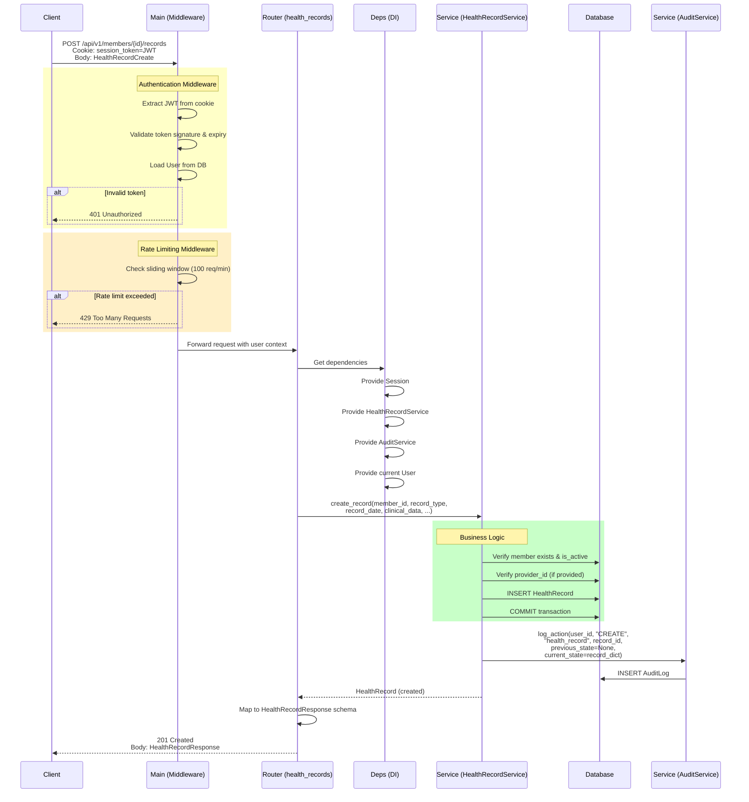
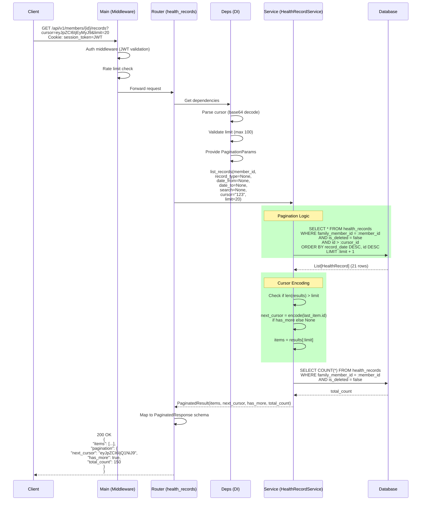
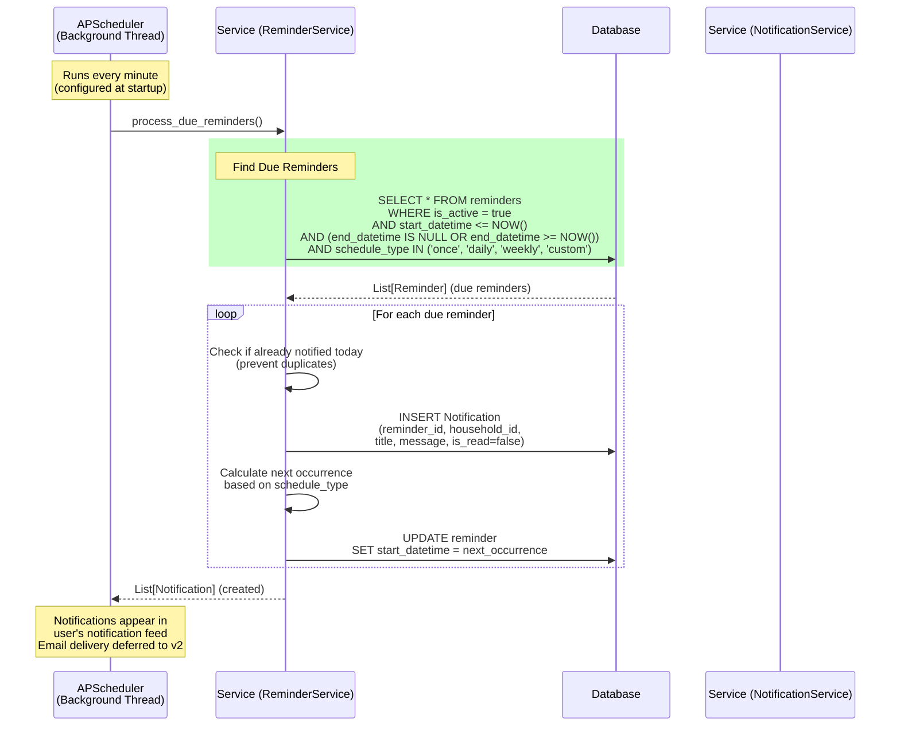
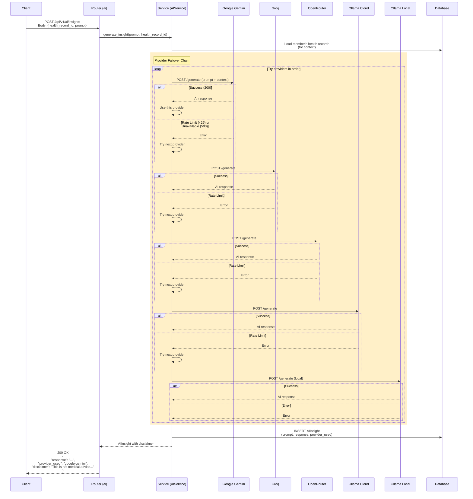
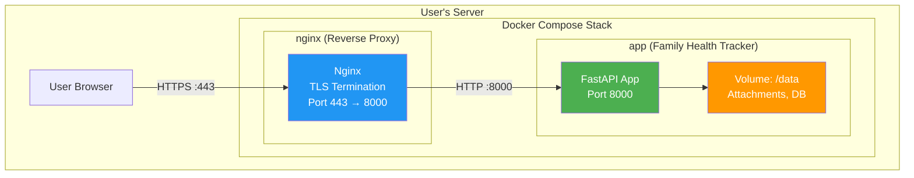

# Design — Family Health Tracker

> Phase p4 — Architecture design derived from `docs/02-spec/SPEC.md` and `docs/03-review/REVIEW.md`.

---

## 1. Component Diagram

```mermaid
graph TD
    subgraph "External"
        Client[Web/Mobile Client]
        AIProviders[AI Providers<br/>Gemini/Groq/OpenRouter/Ollama]
    end

    subgraph "backend/app/"
        subgraph "Core Layer"
            Config[app.core.config<br/>Settings, Env Vars]
            DB[app.core.database<br/>Session Management,<br/>SQLCipher Setup]
            Security[app.core.security<br/>Password Hashing,<br/>JWT Handling]
        end

        subgraph "Main Entry"
            Main[app.main<br/>FastAPI App,<br/>Middleware Registration]
        end

        subgraph "Routers"
            AuthRouter[app.routers.auth<br/>/api/v1/auth/*]
            HouseholdRouter[app.routers.household<br/>/api/v1/household]
            MemberRouter[app.routers.members<br/>/api/v1/members/*]
            ProviderRouter[app.routers.providers<br/>/api/v1/providers/*]
            RecordRouter[app.routers.health_records<br/>/api/v1/records/*]
            AttachmentRouter[app.routers.attachments<br/>/api/v1/attachments/*]
            AIRouter[app.routers.ai<br/>/api/v1/ai/*]
            ConversationRouter[app.routers.conversations<br/>/api/v1/conversations/*]
            ReminderRouter[app.routers.reminders<br/>/api/v1/reminders/*]
            NotificationRouter[app.routers.notifications<br/>/api/v1/notifications/*]
            AuditRouter[app.routers.audit<br/>/api/v1/audit-logs/*]
        end

        subgraph "Services"
            AuthService[app.services.auth_service<br/>IAuthService]
            HouseholdService[app.services.household_service<br/>IHouseholdService]
            MemberService[app.services.member_service<br/>IMemberService]
            ProviderService[app.services.provider_service<br/>IProviderService]
            RecordService[app.services.health_record_service<br/>IHealthRecordService]
            AttachmentService[app.services.attachment_service<br/>IAttachmentService]
            AIService[app.services.ai_service<br/>IAIService]
            ReminderService[app.services.reminder_service<br/>IReminderService]
            NotificationService[app.services.notification_service<br/>INotificationService]
            AuditService[app.services.audit_service<br/>IAuditService]
        end

        subgraph "Models"
            UserModel[app.models.base<br/>User, Household,<br/>FamilyMember, Provider,<br/>HealthRecord, Attachment,<br/>AIInsight, Conversation,<br/>Message, Reminder,<br/>Notification, AuditLog]
        end

        subgraph "Schemas"
            Schemas[app.schemas.*<br/>Pydantic v2 Models:<br/>Create/Update/Response]
        end

        subgraph "Utilities"
            Deps[app.core.deps<br/>Dependency Injection]
            RateLimit[app.core.rate_limiter<br/>Sliding Window Limiter]
            Storage[app.core.storage<br/>File Storage Abstraction]
        end
    end

    %% External to Main
    Client --> Main

    %% Main to Core
    Main --> Config
    Main --> DB
    Main --> Security

    %% Main to Routers
    Main --> AuthRouter
    Main --> HouseholdRouter
    Main --> MemberRouter
    Main --> ProviderRouter
    Main --> RecordRouter
    Main --> AttachmentRouter
    Main --> AIRouter
    Main --> ConversationRouter
    Main --> ReminderRouter
    Main --> NotificationRouter
    Main --> AuditRouter

    %% Routers to Services (via Deps)
    AuthRouter --> Deps
    HouseholdRouter --> Deps
    MemberRouter --> Deps
    ProviderRouter --> Deps
    RecordRouter --> Deps
    AttachmentRouter --> Deps
    AIRouter --> Deps
    ConversationRouter --> Deps
    ReminderRouter --> Deps
    NotificationRouter --> Deps
    AuditRouter --> Deps

    Deps --> AuthService
    Deps --> HouseholdService
    Deps --> MemberService
    Deps --> ProviderService
    Deps --> RecordService
    Deps --> AttachmentService
    Deps --> AIService
    Deps --> ReminderService
    Deps --> NotificationService
    Deps --> AuditService

    %% Services to Models
    AuthService --> UserModel
    HouseholdService --> UserModel
    MemberService --> UserModel
    ProviderService --> UserModel
    RecordService --> UserModel
    AttachmentService --> UserModel
    AIService --> UserModel
    ReminderService --> UserModel
    NotificationService --> UserModel
    AuditService --> UserModel

    %% Services to Core
    AuthService --> Security
    AuthService --> DB
    HouseholdService --> DB
    MemberService --> DB
    ProviderService --> DB
    RecordService --> DB
    AttachmentService --> DB
    AttachmentService --> Storage
    AIService --> DB
    AIService --> AIProviders
    ReminderService --> DB
    NotificationService --> DB
    AuditService --> DB

    %% Routers to Schemas
    AuthRouter --> Schemas
    HouseholdRouter --> Schemas
    MemberRouter --> Schemas
    ProviderRouter --> Schemas
    RecordRouter --> Schemas
    AttachmentRouter --> Schemas
    AIRouter --> Schemas
    ConversationRouter --> Schemas
    ReminderRouter --> Schemas
    NotificationRouter --> Schemas
    AuditRouter --> Schemas

    %% Rate limiting
    Main --> RateLimit
    RateLimit --> Config
```

---

## 2. Module Responsibilities

### 2.1 Core Layer (`app/core/`)

| Module | Responsibility | Key Components |
|--------|----------------|----------------|
| `config.py` | Centralized configuration via pydantic-settings | `Settings` class, env var parsing, singleton instance |
| `database.py` | Database engine, session factory, SQLCipher setup | `create_engine()`, `SessionLocal`, `get_db()` dependency |
| `security.py` | Password hashing, JWT token operations | `hash_password()`, `verify_password()`, `create_token()`, `decode_token()` |
| `deps.py` | Dependency injection for routers | `get_current_user()`, service providers, `PaginationParams` |
| `rate_limiter.py` | Sliding window rate limiting | `RateLimiter` class, in-memory store, `check_limit()` |
| `storage.py` | File storage abstraction | `save_file()`, `save_file_hashed()`, `stream_file()`, `get_file()`, `delete_file()`, `hash_existing_file()`, `sweep_orphaned_staging()`, MIME validation, streaming I/O |
| `storage_backends/` | Pluggable storage backends | `StorageBackend` protocol, `LocalStorageBackend` (sharded content-addressable), `get_storage_backend()` factory |
| `thumbnails.py` | Thumbnail generation | `generate_thumbnail()` (Pillow for images, PyMuPDF for PDFs → 300px WebP) |
| `encryption.py` | Encryption at rest | `encrypt_bytes()`, `decrypt_bytes()`, `encrypt_file()`, `decrypt_file()` (Fernet via PBKDF2) |
| `migrate_files.py` | One-time data migration | `migrate_all()` — migrate flat files to content-addressed, compute hashes, generate thumbnails, encrypt |

### 2.2 Main Entry (`app/main.py`)

| Responsibility | Details |
|----------------|---------|
| FastAPI app instantiation | `app = FastAPI(title="Family Health Tracker")` |
| CORS middleware | Configured for frontend origin |
| Authentication middleware | JWT cookie extraction, user context |
| Rate limiting middleware | 100 req/min per session |
| Router registration | Include all routers with `/api/v1` prefix |
| Exception handlers | Global HTTPException handler, validation error formatter |
| Health check endpoint | `GET /api/v1/health` (no auth) |
| Startup/shutdown events | DB connection init, reminder scheduler start, staging file sweep |
| Background jobs | Reminders (60s), backup rotation (24h), AI health check (5m), anomaly detection (6h), staging cleanup (1h), file integrity check (24h), token pruning (24h), DB backup (24h) |

### 2.3 Routers (`app/routers/`)

| Router | Path | Methods | Service Used |
|--------|------|---------|--------------|
| `auth.py` | `/api/v1/auth` | POST register, login, logout; GET me | `IAuthService` |
| `household.py` | `/api/v1/household` | GET, PUT | `IHouseholdService` |
| `members.py` | `/api/v1/members` | GET list, POST create; GET/PUT/DELETE {id}; GET {id}/dashboard | `IMemberService` |
| `providers.py` | `/api/v1/providers` | GET list, POST create; GET/PUT/DELETE {id} | `IProviderService` |
| `health_records.py` | `/api/v1/members/{id}/records` | GET list, POST create; GET/PUT/DELETE {record_id}; GET timeline, lab-records, export-pdf | `IHealthRecordService` |
| `attachments.py` | `/api/v1/attachments` | POST upload, GET download (streaming), GET thumbnail, DELETE | `IAttachmentService` |
| `ai.py` | `/api/v1/ai` | POST insights, explain | `IAIService` |
| `conversations.py` | `/api/v1/conversations` | GET list, POST create; GET {id}, DELETE {id}; POST {id}/messages | `IAIService` |
| `reminders.py` | `/api/v1/reminders` | GET list, POST create; GET/PUT/DELETE {id} | `IReminderService` |
| `notifications.py` | `/api/v1/notifications` | GET list; PUT {id}/read; DELETE {id} | `INotificationService` |
| `audit.py` | `/api/v1/audit-logs` | GET list | `IAuditService` |

### 2.4 Services (`app/services/`)

| Service | Key Methods | Dependencies |
|---------|-------------|--------------|
| `AuthService` | `register_user()`, `authenticate()`, `create_session_token()`, `get_current_user()` | `User`, `Household`, `security` |
| `HouseholdService` | `get_or_create_household()`, `update_household()` | `Household`, `DB` |
| `MemberService` | `create_member()`, `get_member()`, `list_members()`, `update_member()`, `soft_delete_member()`, `get_brief_medical_history()`, `get_active_medications()` | `FamilyMember`, `HealthRecord`, `DB` |
| `ProviderService` | `create_provider()`, `get_provider()`, `list_providers()`, `update_provider()`, `delete_provider()`, `assign_provider_to_member()`, `get_member_providers()`, `remove_provider_assignment()` | `Provider`, `ProviderAssignment`, `DB` |
| `HealthRecordService` | `create_record()`, `get_record()`, `list_records()`, `update_record()`, `soft_delete_record()`, `get_timeline()`, `get_lab_records_view()` | `HealthRecord`, `Provider`, `DB` |
| `AttachmentService` | `upload_attachment()`, `get_attachment()`, `download_attachment()` (streaming), `delete_attachment()` (ref-counted), `attach_staged_file()` | `Attachment`, `Storage`, `Thumbnails`, `Encryption`, `DB` |
| `AIService` | `generate_insight()`, `explain_records()`, `chat()`, `detect_trends()`, `check_drug_interactions()` | `AIInsight`, `Message`, `AIProviders`, `DB` |
| `ReminderService` | `create_reminder()`, `get_reminder()`, `list_reminders()`, `update_reminder()`, `delete_reminder()`, `process_due_reminders()` | `Reminder`, `Notification`, `DB` |
| `NotificationService` | `list_notifications()`, `mark_as_read()`, `delete_notification()` | `Notification`, `DB` |
| `AuditService` | `log_action()`, `list_audit_logs()` | `AuditLog`, `DB` |

### 2.5 Models (`app/models/`)

Domain-specific model modules, re-exported from `app/models/base.py`:
- `User`, `Household`, `FamilyMember`
- `Provider`, `ProviderAssignment`
- `HealthRecord`, `Attachment` (with `content_hash`, `storage_backend`, `thumbnail_path`, `encrypted` columns), `AIInsight`
- `Conversation`, `Message`
- `Reminder`, `Notification`
- `AuditLog`, `HealthAlert`

Plus enum types: `Gender`, `Relationship`, `RecordType`, `ReminderType`, `ScheduleType`, `MessageRole`, `ConversationScope`.

### 2.6 Schemas (`app/schemas/`)

| Schema Module | Classes |
|---------------|---------|
| `user.py` | `UserCreate`, `UserUpdate`, `UserResponse` |
| `household.py` | `HouseholdCreate`, `HouseholdUpdate`, `HouseholdResponse` |
| `family_member.py` | `MedicalHistoryQuestionnaire`, `FamilyMemberCreate`, `FamilyMemberUpdate`, `FamilyMemberResponse` |
| `provider.py` | `ProviderCreate`, `ProviderUpdate`, `ProviderResponse` |
| `provider_assignment.py` | `ProviderAssignmentCreate`, `ProviderAssignmentResponse` |
| `health_record.py` | `HealthRecordCreate`, `HealthRecordUpdate`, `HealthRecordResponse` |
| `attachment.py` | `AttachmentResponse` (with `content_hash`, `storage_backend`, `thumbnail_path`, `encrypted` fields) |
| `ai_insight.py` | `AIInsightRequest`, `AIInsightResponse` |
| `conversation.py` | `ConversationCreate`, `ConversationResponse` |
| `message.py` | `MessageCreate`, `MessageResponse` |
| `reminder.py` | `ReminderCreate`, `ReminderUpdate`, `ReminderResponse` |
| `notification.py` | `NotificationResponse` |
| `auth.py` | `LoginRequest`, `LoginResponse`, `UserResponse` |
| `common.py` | `ErrorResponse`, `PaginatedResponse` |

---

## 3. Sequence Diagrams

### 3.1 Authenticated Write Operation (Create Health Record)



---

### 3.2 Paginated List Query (List Health Records)



---

### 3.3 Background/Async Task (Reminder Processing)



---

### 3.4 AI Provider Failover Chain



---

## 4. Directory Structure

```
backend/app/
├── __init__.py
├── main.py                 # FastAPI app, middleware, router registration
├── core/
│   ├── __init__.py
│   ├── config.py           # Settings, env var parsing
│   ├── database.py         # Engine, session factory, SQLCipher
│   ├── security.py         # Password hashing, JWT
│   ├── deps.py             # Dependency injection
│   ├── rate_limiter.py     # Sliding window limiter
│   ├── storage.py          # File storage (streaming I/O, content-addressable)
│   ├── thumbnails.py       # Thumbnail generation (Pillow, PyMuPDF → WebP)
│   ├── encryption.py       # Fernet encryption at rest
│   ├── migrate_files.py    # One-time storage migration script
│   ├── storage_backends/   # Pluggable storage backend
│   │   ├── __init__.py
│   │   ├── protocol.py     # StorageBackend Protocol
│   │   ├── local.py        # LocalStorageBackend
│   │   └── factory.py      # get_storage_backend() factory
│   ├── jobs.py             # Background jobs (reminders, staging cleanup, integrity check)
│   └── scheduler.py        # APScheduler wrapper
├── routers/
│   ├── __init__.py
│   ├── auth.py
│   ├── household.py
│   ├── members.py
│   ├── providers.py
│   ├── health_records.py
│   ├── attachments.py
│   ├── ai.py
│   ├── conversations.py
│   ├── reminders.py
│   ├── notifications.py
│   └── audit.py
├── services/
│   ├── __init__.py
│   ├── auth_service.py
│   ├── household_service.py
│   ├── member_service.py
│   ├── provider_service.py
│   ├── health_record_service.py
│   ├── attachment_service.py
│   ├── ai_service.py
│   ├── reminder_service.py
│   ├── notification_service.py
│   └── audit_service.py
├── schemas/
│   ├── __init__.py
│   ├── user.py
│   ├── household.py
│   ├── family_member.py
│   ├── provider.py
│   ├── provider_assignment.py
│   ├── health_record.py
│   ├── attachment.py
│   ├── ai_insight.py
│   ├── conversation.py
│   ├── message.py
│   ├── reminder.py
│   ├── notification.py
│   ├── auth.py
│   └── common.py
└── models/
    └── base.py             # All SQLAlchemy models + enums
```

---

## 5. Technology Decisions Summary

| Decision | Choice | Rationale |
|----------|--------|-----------|
| **Database** | SQLite + SQLCipher | Single-file encrypted DB, zero-config deployment, sufficient for single-household v1 |
| **ORM** | SQLAlchemy 2.x | Type-safe, async-ready, mature ecosystem |
| **Auth** | JWT in HTTP-only cookie | Stateless, secure against XSS, works with reverse proxy TLS |
| **Password Hashing** | Argon2 | Winner of Password Hashing Competition, memory-hard |
| **Pagination** | Cursor-based | Stable for real-time data, no offset drift |
| **Rate Limiting** | Sliding window, in-memory | Simple, no external Redis dependency for v1 |
| **File Storage** | Local filesystem, content-addressable, sharded | Self-hosted, deduplication via SHA-256, pluggable backend protocol |
| **File Encryption** | Fernet (cryptography library) | PBKDF2-derived key from SECRET_KEY, 480k iterations |
| **AI Failover** | Ordered provider chain | Maximizes availability, transparent to user |
| **Scheduler** | APScheduler | Lightweight, embedded, no external service |

---

## 6. Security Design

### 6.1 Authentication Flow

```
1. User submits credentials → POST /api/v1/auth/login
2. AuthService.authenticate() verifies password hash
3. AuthService.create_session_token() generates JWT:
   - Payload: {sub: user_id, exp: now + 24h, iat: now}
   - Algorithm: HS256
   - Secret: Settings.JWT_SECRET (32+ bytes)
4. Token set as HTTP-only cookie:
   - Set-Cookie: session_token=<JWT>; HttpOnly; Secure; SameSite=Lax; Path=/
5. Subsequent requests include cookie automatically
6. Middleware extracts token, validates, loads user into request.state
```

### 6.2 Password Storage

```python
# app/core/security.py
from passlib.context import CryptContext

pwd_context = CryptContext(schemes=["argon2"], deprecated="auto")

def hash_password(password: str) -> str:
    return pwd_context.hash(password)

def verify_password(plain: str, hashed: str) -> bool:
    return pwd_context.verify(plain, hashed)
```

### 6.3 SQLCipher Setup

```python
# app/core/database.py
from sqlalchemy import create_engine

def get_connection_url(db_path: str, password: str) -> str:
    # SQLCipher connection: sqlite:///:memory:?key=...
    return f"sqlite:///{db_path}?_pragma=page_size=4096&_pragma=cipher_page_size=4096&_pragma=key='{password}'"

engine = create_engine(
    get_connection_url(Settings.DB_PATH, Settings.DB_PASSWORD),
    connect_args={"check_same_thread": False}
)
```

---

## 7. Deployment Architecture



### 7.1 Docker Compose Configuration

```yaml
# docker-compose.yml
version: '3.8'

services:
  app:
    build: ./backend
    container_name: health-tracker-app
    environment:
      - DATABASE_PASSWORD=${DB_PASSWORD}
      - JWT_SECRET=${JWT_SECRET}
      - AI_PROVIDER_KEYS=${AI_PROVIDER_KEYS}
    volumes:
      - health_data:/data
    restart: unless-stopped
    networks:
      - health-net

  nginx:
    image: nginx:alpine
    container_name: health-tracker-proxy
    ports:
      - "443:443"
    volumes:
      - ./nginx.conf:/etc/nginx/nginx.conf
      - ./ssl:/etc/nginx/ssl:ro
    depends_on:
      - app
    restart: unless-stopped
    networks:
      - health-net

volumes:
  health_data:
  ssl:

networks:
  health-net:
    driver: bridge
```

---

## 8. ADR References

| ADR | Title | Location |
|-----|-------|----------|
| ADR-001 | SQLite with SQLCipher for Encrypted Storage | `ADR/001-database-sqlite-sqlcipher.md` |
| ADR-002 | JWT in HTTP-only Cookie for Session Management | `ADR/002-auth-jwt-cookie.md` |
| ADR-003 | Cursor-based Pagination for List Endpoints | `ADR/003-pagination-cursor.md` |
| ADR-004 | Multi-provider AI Failover Chain | `ADR/004-ai-provider-failover.md` |
| ADR-005 | In-memory Rate Limiting for v1 | `ADR/005-rate-limit-in-memory.md` |
| ADR-006 | Content-Addressable Storage with Dedup and Encryption | `ADR/006-content-addressable-storage.md` |

---

## 9. Implementation Phases

### Phase 1: Foundation
1. Set up project structure, dependencies
2. Implement core layer (config, database, security, deps)
3. Create SQLAlchemy models
4. Create Pydantic schemas

### Phase 2: Auth & Household
1. Implement AuthService
2. Implement AuthRouter (register, login, logout, me)
3. Implement HouseholdService and HouseholdRouter

### Phase 3: Members & Providers
1. Implement MemberService, MemberRouter
2. Implement ProviderService, ProviderRouter
3. Implement medical history questionnaire wizard

### Phase 4: Health Records
1. Implement HealthRecordService, HealthRecordRouter
2. Implement record type-specific validation
3. Implement timeline and lab records views

### Phase 5: Attachments & AI
1. Implement AttachmentService, AttachmentRouter
2. Implement AIService with provider failover
3. Implement AIRouter (insights, explain)

### Phase 6: Conversations
1. Implement conversation/message models
2. Implement chat endpoint with AI integration
3. Implement conversation history retrieval

### Phase 7: Reminders & Notifications
1. Implement ReminderService, ReminderRouter
2. Implement NotificationService, NotificationRouter
3. Set up APScheduler for background processing

### Phase 8: Audit & Polish
1. Implement AuditService, AuditRouter
2. Add comprehensive logging
3. Docker Compose setup
4. End-to-end testing
